# Session 1: Introduction

## NSK108

Is a board that is made for educational purposes.
It is build by [Noavaran Electronic](http://www.ne-ir.com/).
It supports AVR and MCS-51 microcontroller,
In this class we are working on an AVR microcontroller,
called Atmega32.

In the picture above, you can see the board that we are
working on this class.

## Programmer

To program our code to the microcontroller, we are
using ISP programmer. In the picture below you can
see the programmer that we are using right now.
We are connecting this programmer to our pc via usb
port.
Also, we connect the ISP to the board.

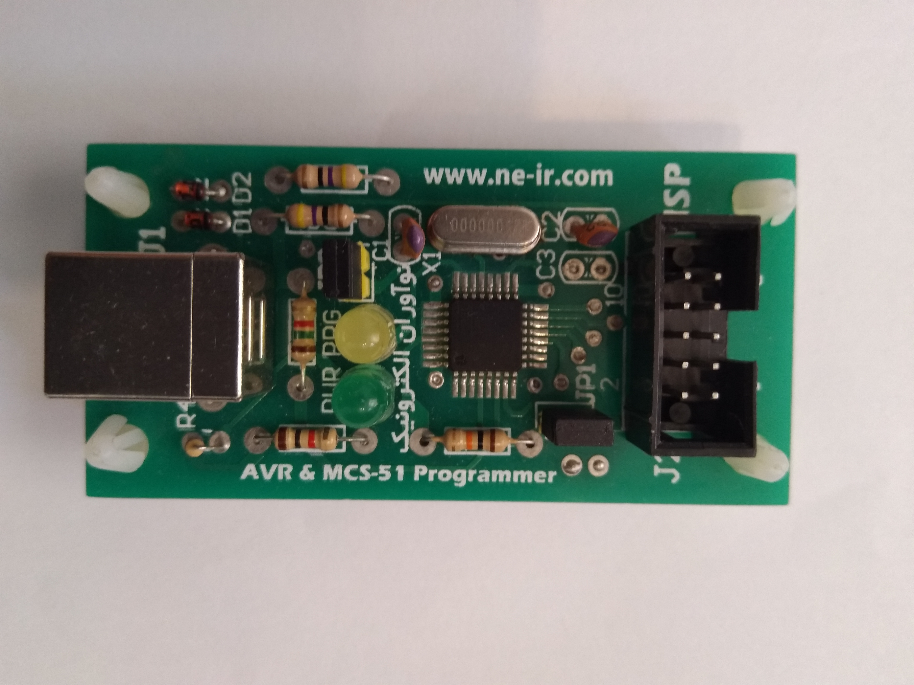

## ATmega32

ATmega32 is an 8-bit AVR microcontroller developed
by Atmel (now Microchip Technology).
Commonly used in embedded systems, robotics,
and industrial automation due to its low power
consumption and ease of use.

* 32 KB of flash memory
    * non-volatile
    * Where our program is stored
* 2 KB of SRAM
    * volatile
    * Where our variables, stack operations and buffer is stored
* 1 KB of EEPROM
    * non-volatile
    * Config that we want it to remain
* 32 general-purpose I/O pins
* 8-channel 10-bit ADC
* 3 timers (one 8-bit, two 16-bit)
* UART, SPI, and I2C communication interfaces

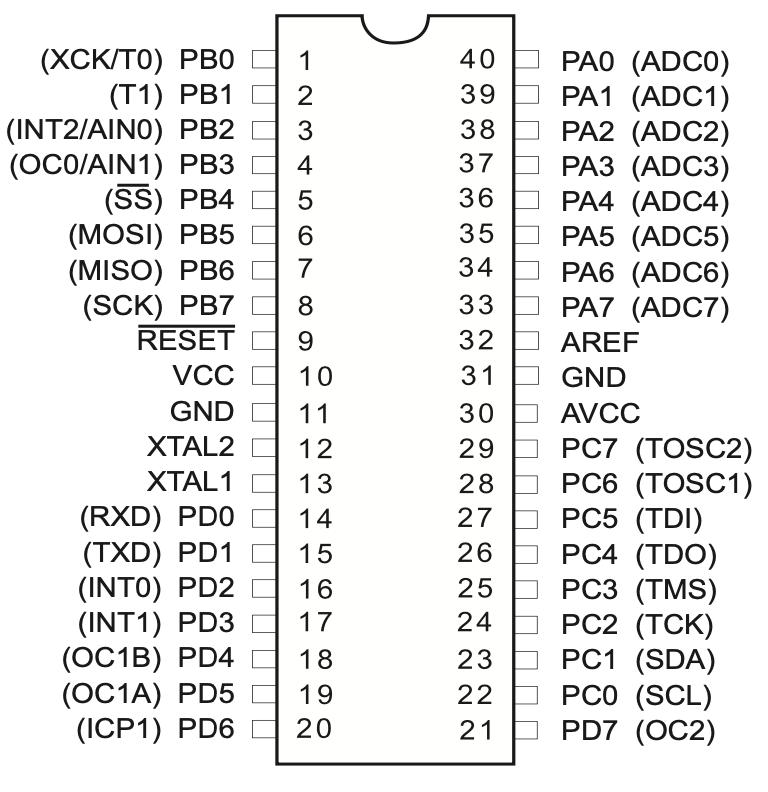

In the picture above, you can see the pins on
ATmega32.
There are 32 geneal-purpose I/O pins:

* PA
* PB
* PC
* PD

Each pin is connected to a component on the board
which we are going to explain them in the according
lesson.
All of these 32 pins can be set as an output or an input.
(using their DDR)

## jumper

A removable connector that is used to connect to pins
on the board. There is an example of a jumper in the picture
below.

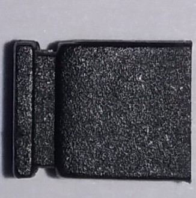

In this board most of the time there are 3 positions that
you can put a jumper on:

* on
* off
* none

The picture below shows the position of
a jumper in "on" position in "JP1".

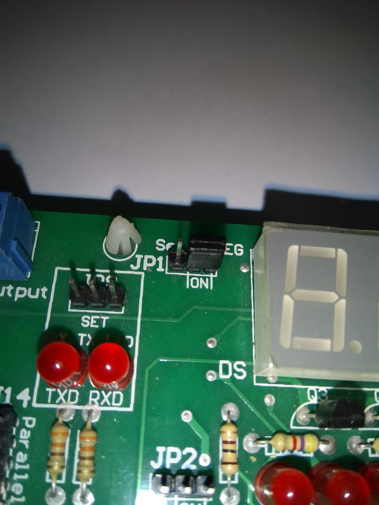

Also, The picture below shows the position of
a jumper in "off" position in "JP1".

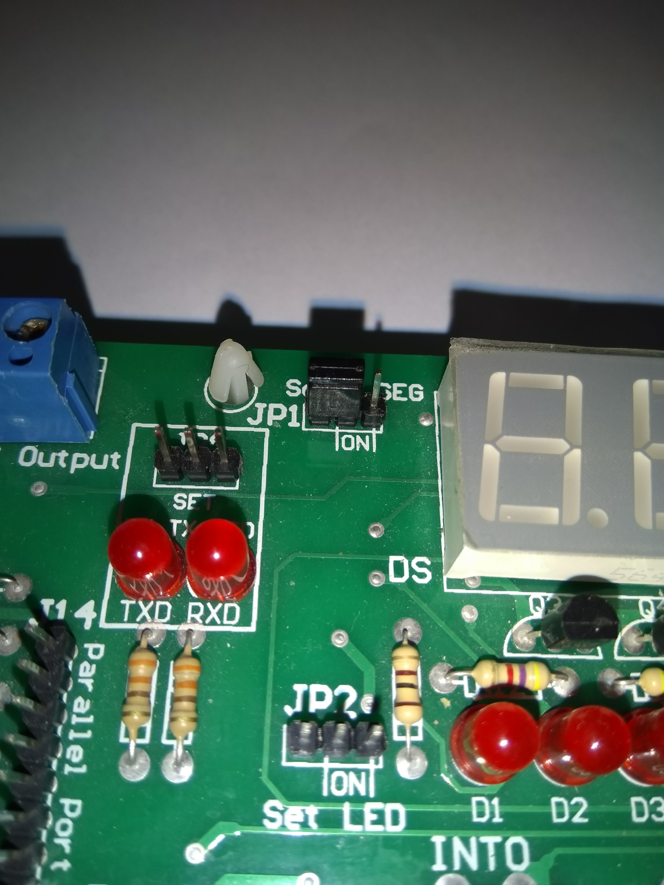

And lastly, The picture below has no jumper in "JP1".

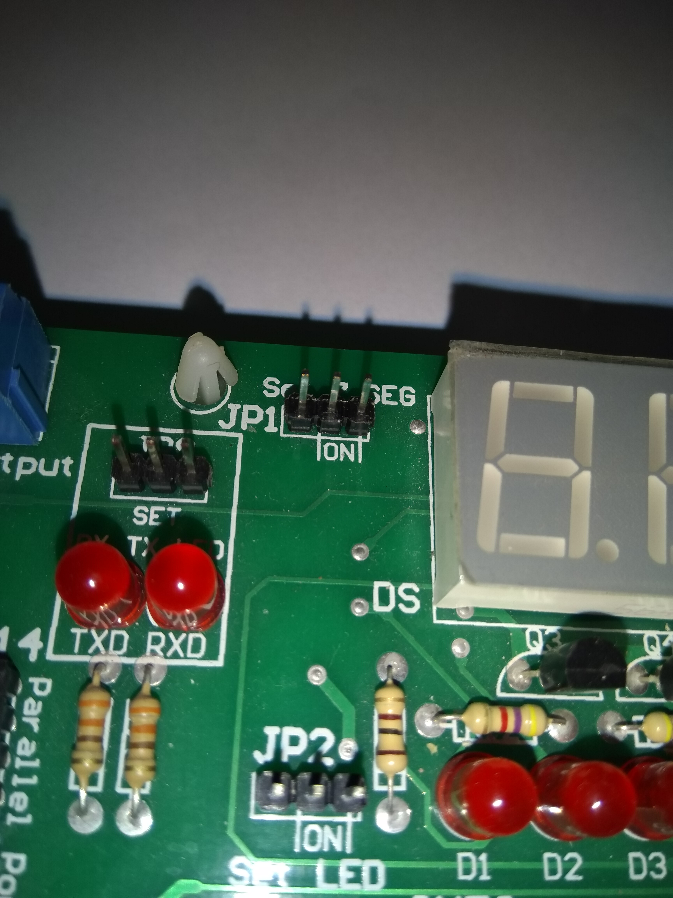

## ProgISP

The application that we are using to program our compiled
code to our microcontroller is "ProgISP". In the picture
below there is an example of the application.

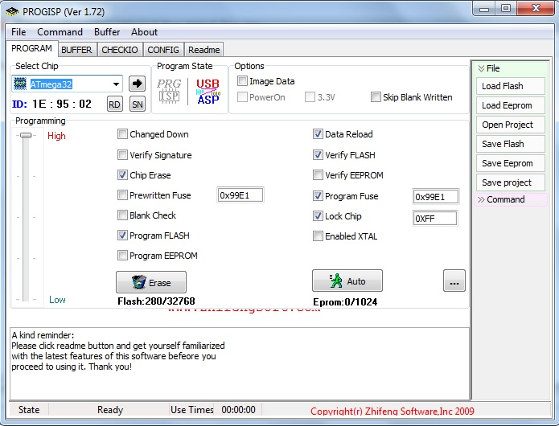

First we should make sure that our chipset is selected
to `ATmega32`. Second we should press that 3 dots on the
right side of `Auto`. Then a window like the picture below
would show up. there are some changes that we should do
on that window which are:

* `CKSEL0`: 0
* `CKSEL2`: 1
* `JTAGEN`: 1

After doing these steps, make sure that `LowValue` is
equal to `E4` and `HighValue` is equal to `D9`.

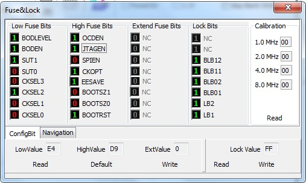

### Erase

Removes the code that is programmed.

### Load Flash

Loads the `.hex` file that we compiled.

### Write Flash

Writes the loaded flash to the chip.

### Auto

Does the following things in order:
* Erase
* Write flash
* Verify flash
* Write Fuse
* Lock chip

## CodeVisionAVR

CodeVisionAVR is an IDE for programming AVR microcontrollers.
We are using CodeVisionAVR in this course.

### Create a new project

To create a new project you can simpy go to File->New 
(or press Ctrl+N).
Then a window like the window below will show up.
for file type, select `Project` then press `OK`.

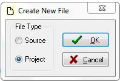

After that, a window like the picture below will show
up that you should choose yes which means that you want
to use CodeWizardAVR.

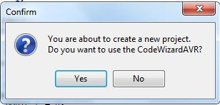

Then in the next window select the first option which
has the `ATmega` chip on it.

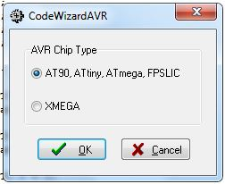

After that in the `Chip` section in the `Chip` part
select `ATmega32`.

For the next step you should click on the **gear** logo
on top of the window which does the following job: 
*generate program, save and exit*

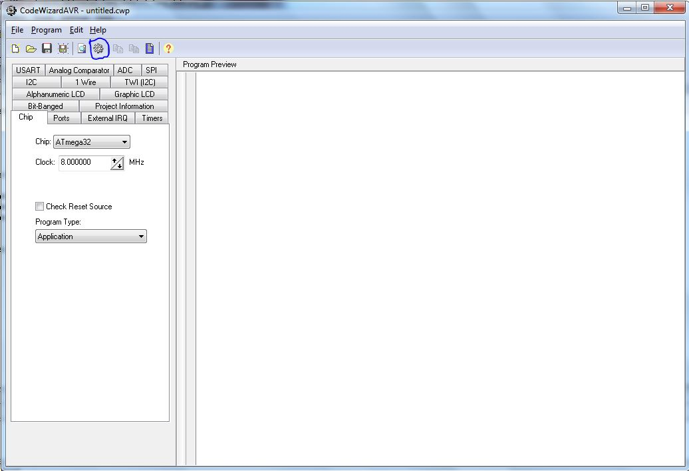

Choose the path that you want to save your project.
Then on the 3 according window put a name that you 
want to be the name of your source file, project and
code wizard project (I mostly put the names of the directory
and all the other 3 the same).

## Hello world

Get the [hello_world.hex](../hex_example/hello_world.hex) then
load it on `ProgISP` and press `Auto`.
The output should be displayed like the image below.
If not remove the power supply and reconnect it again.

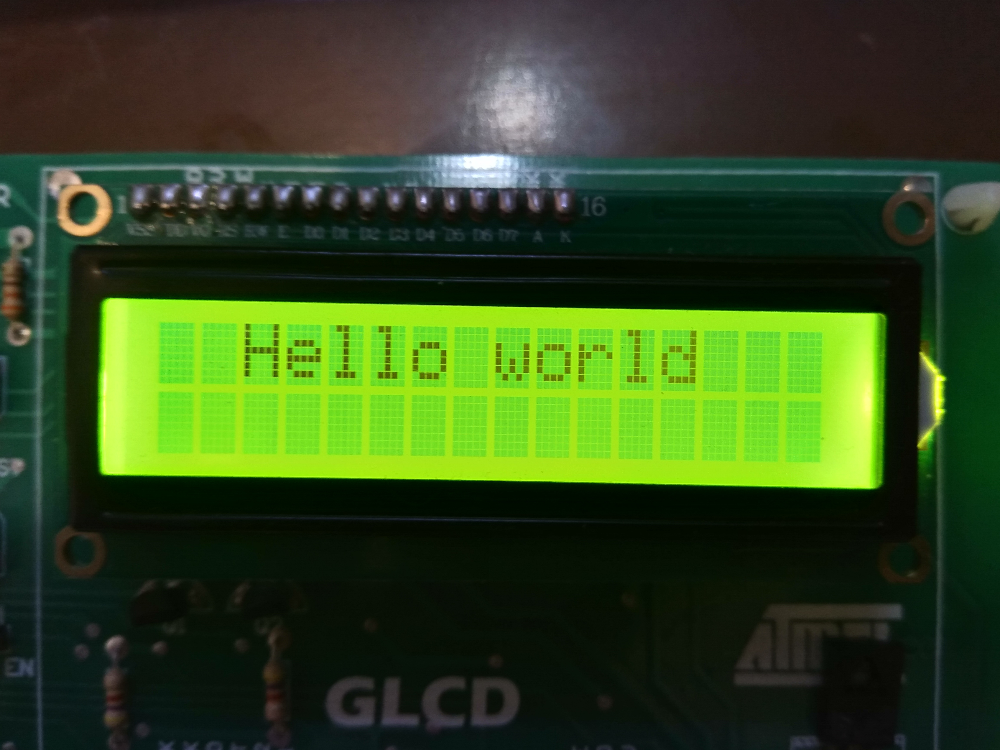