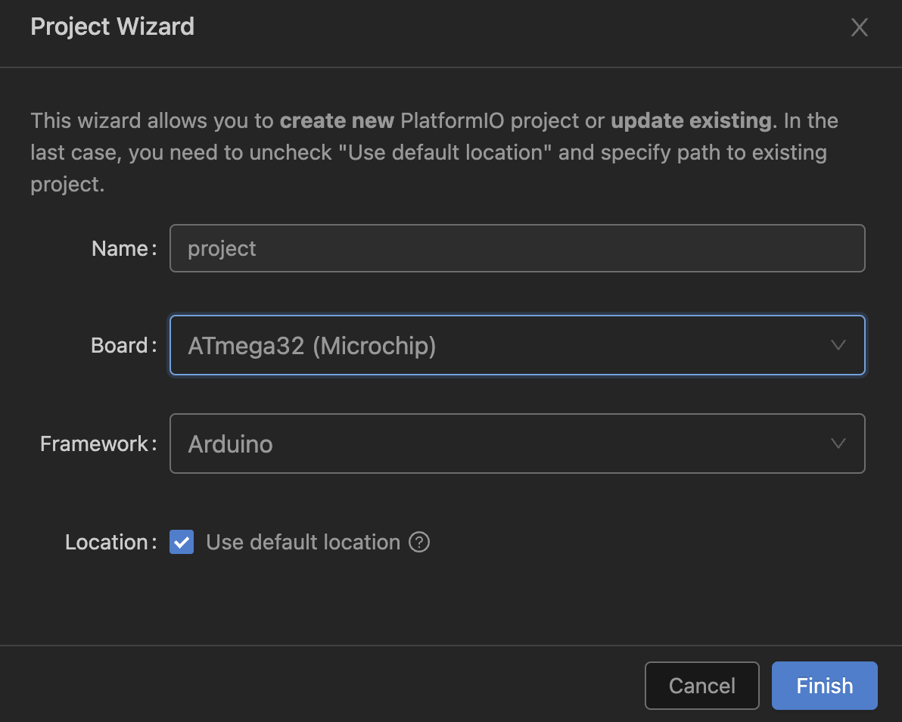
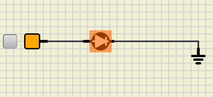
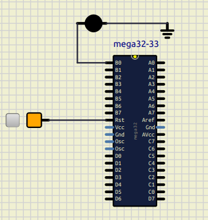
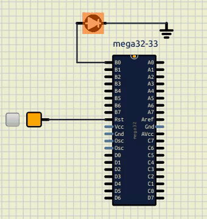

# Session 1: Introduction

## NSK108

Is a board that is made for educational purposes.
It is build by [Noavaran Electronic](http://www.ne-ir.com/).
It supports AVR and MCS-51 microcontroller,
In this class we are working on an AVR microcontroller,
called Atmega32.


In the picture above, you can see the board that we are
working on this class.

## Programmer

To program our code to the microcontroller, we are
using ISP programmer. In the picture below you can
see the programmer that we are using right now.
We are connecting this programmer to our pc via usb
port.
Also, we connect the ISP to the board.


## ATmega32

ATmega32 is an 8-bit AVR microcontroller developed
by Atmel (now Microchip Technology).
Commonly used in embedded systems, robotics,
and industrial automation due to its low power
consumption and ease of use.

* 32 KB of flash memory
    * non-volatile
    * Where our program is stored
* 2 KB of SRAM
    * volatile
    * Where our variables, stack operations and buffer is stored
* 1 KB of EEPROM
    * non-volatile
    * Config that we want it to remain
* 32 general-purpose I/O pins
* 8-channel 10-bit ADC
* 3 timers (one 8-bit, two 16-bit)
* UART, SPI, and I2C communication interfaces


In the picture above, you can see the pins on
ATmega32.
There are 32 geneal-purpose I/O pins:

* PA
* PB
* PC
* PD

Each pin is connected to a component on the board
which we are going to explain them in the according
lesson.
All of these 32 pins can be set as outputs or inputs.
(using their DDR)

## jumper

A removable connector that is used to connect to pins
on the board. There is an example of a jumper in the picture
below.


In this board most of the time there are 3 positions that
you can put a jumper on:

* on
* off
* none

The picture below shows the position of
a jumper in "on" position in "JP1".


Also, The picture below shows the position of
a jumper in "off" position in "JP1".


And lastly, The picture below has no jumper in "JP1".


## SimulIDE

SimulIDE is a simplified IDE for simulating circuits.
It is a free and open-source software and exteremly good for teaching purposes.
More advanced IDEs are:
* Proteus
* Multisim
* KiCad

To install SimulIDE you can simply download it from the link below:

[SimulIDE](https://www.simulide.com/p/downloads.html)

Then extract the zip file and run the executable file.

## PlatformIO

PlatformIO is an open-source extension for Visual Studio Code.
It is a well-kown IDE for embedded systems.
It supports a wide range of microcontrollers and boards.
We are using PlatformIO to write our code and make a hex file.
Then we are using the ISP programmer to program the hex file to the microcontroller
or we can use the simulator to simulate the code.

To install PlatformIO, first you should have visual studio code installed on your machine.
Then you can go to the extensions tab and search for PlatformIO.
After installing the extension, you can start a new project and select the board that you are working on.
It will download all the necessary files needed for your project.
In this course we are using the Atmega32 board.
So when we are creating a new project, we are selecting ATMega32 as our board, like the picture below.



After our project is created, a folder will be created in the directory that you have selected.
In this folder, you can see the "src" folder which contains the main.cpp file.
We write our code in this file.
The template that is created for us is like the code below:

```cpp
#include <Arduino.h>

// put function declarations here:
int myFunction(int, int);

void setup() {
  // put your setup code here, to run once:
  int result = myFunction(2, 3);
}

void loop() {
  // put your main code here, to run repeatedly:
}

// put function definitions here:
int myFunction(int x, int y) {
  return x + y;
}
```

In the code above, you can see the setup and loop functions.
These two functions are the ones that we are using, and we can delete the other functions.
So we end up with the code like below:

```cpp
#include <Arduino.h>

void setup()
{
}

void loop()
{
}
```

In setup function, we are initializing the pins and the components that we are using.
In loop function, we are writing the main code that we want to run repeatedly (it is like a `while True`).
To make the hex file, we can simply click on the "tick" icon on the bottom of the screen.
Then the hex file will be created in the ".pio/build/ATmega32" folder.

## `avrdude`

`avrdude` is a command-line tool that is used to program the hex file to the microcontroller.
To install `avrdude` on `Ubuntu` you can simply run the command below:

```bash 
sudo apt install avrdude
```

Other linux distributions also contain avrdude that you can get them from their package manager.
To program our code to the microcontroller, we can use the command below:

```bash
avrdude -c usbasp -p m32 -U flash:w:.pio/build/ATmega32/firmware.hex
```

## A simple LED blink code

To make a simple LED blink code, first we should put an LED on the board.
To do that we do these steps:
* Put an `led` (`Outputs`/`Leds`/`LED`) on the board.
* Put a `fixed voltage` on the board.
* Put a `ground` on the board.
* Connect the `fixed voltage` to the `led`'s `anode` (the longest pin).
* Connect the `ground` to the `led`'s `cathode` (the shortest pin).
* Click on the `fixed volatage` to turn it on.
* Run the simulation.

So you should have something like this:



Now we have a working LED on the board.
Now let's put an `ATMega32` on the board and connect the `led` to the `ATMega32`.
To do that we do these steps:

* Put an `ATMega32` (`Micro`/`AVR`/`ATMega32`) on the board.
* Connect the `fixed voltage` to the `Rst` of the `ATMega32`.
* Connect the `anode` of the `LED` to the `PB0` of the `ATMega32`.
* Conncet the `cathode` of the `LED` to the `ground`.

So you should have something like this:



Now let's write the code to make the `LED` blink.
To do that we do these steps:

* Create a new project in `PlatformIO` by selecting `ATMega32` as your board.
* Write the code below in the `main.cpp` file.

```cpp
#include <Arduino.h>

void setup()
{
    DDRB = 0x01;
    PORTB = 0x01;
}

void loop()
{
    PORTB = 0x00;
    delay(500);
    PORTB = 0x01;
    delay(500);
}
```

* Click on the `tick` icon to make the hex file.
* Go to SimulIDE and right click on `ATMega32` and select `Load HEX file`.
* Select the hex file that you have created (.pio/ATMega32/frimware.hex) (you might need to select show hidden files).
* Run the simulation.

So it should be something like this:



Now lets connect your board to our computer and upload our hex file using the code below:

```bash
avrdude -c usbasp -p m32 -U flash:w:.pio/build/ATmega32/firmware.hex
```


