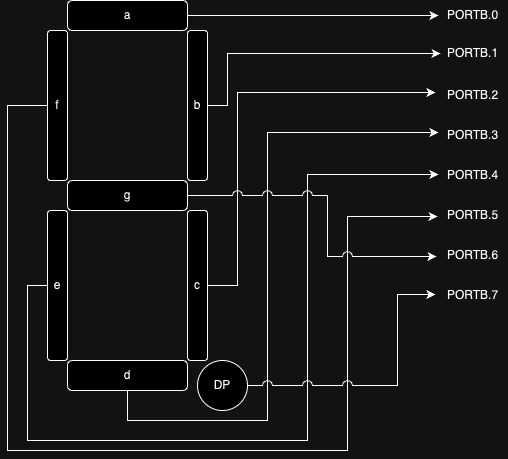
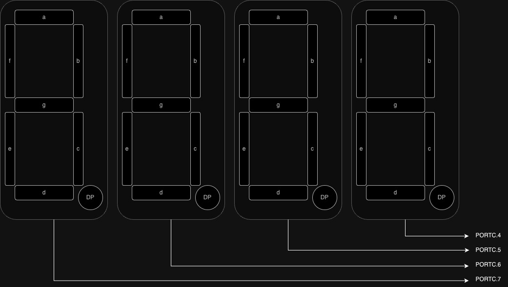

# Session 2: Counter on 7 segments

## Our goal


## Create a new CodeVisionAVR project

We should make a new CodeVisionAVR project
with `ATmega32` selected as the cip.
Then we remove all the comments and all the
initialization, because we want to make
an initialization of our own.

Your code should like this:

```c
#include <mega32.h>

void main(void)
{
    while (1)
    {
    };
}
```

## Define variables in the first block

CodVisionAVR requires us to declare all the variables
that we want in the first block.
So we are not allowed to define a variable
in a routine.

```c
#include <mega32.h>

void main(void)
{
    int a;
    
    while (1)
    {
    };
}
```

## DDR (Data Direction Register)

We can set a pin as an input or an output.
To do so we should just change the DDR of that pin
to `0` or `1`.

* `0`: input
* `1`: output

```c
DDRA.0 = 0;
```

## Declare a bit in C

We can use `0b` to declare a number in a bit format.
For example:

* `0b1` = `1`
* `0b101` = `5`
* `0b11111111` = `255`

## Declare a hex in C

We can use `0x` to declare a number in hex format.
Range of a hex number is between `[0 to 15]` which
is presented like this: `1 2 3 4 5 6 7 8 9 A B C D E F`.
For example:

* `0xF`= `15`
* `0x2F`: $2 \times 16 + 15$ = `47`

## Using hex to initialize our pins

Now if we want to initialize our pins we can do
something like this:

```c
PORTB = 0x00;
DDRB = 0xFF;
```

Which means all the Directions of port `B` are set
to outputs and all the initialize values are set
to `0`.

## 7seg config

As you can see on the picture below,
All the leds in each 7segments are connected
to each pins of `PORTB`.



As it is illustrated in the image below,
To disable or enable each 7segment, we can
use [4, 7] pins in `PORTC`.




:::{important}
All the pins in this experiment are
getting **activated** when we put `0`
in them.
:::


## 7seg initialization

As you can see in the **7seg config** we only need to
control `PORTB` and pins from [4, 7] of `PORTC`.
To do so we should put those pin as outputs also
we put 0 for initialization value. The result would be
something like this:

```c

PORTB = 0x00;
DDRB = 0xFF; // 0b11111111

PORTC = 0x00;
DDRC = 0xF0; // 0b11110000

```

## Create numbers

## Show numbers on 7seg

## Delay

## Counter

## Buzzer config

## Add buzzer

