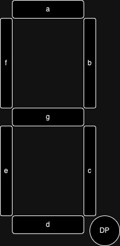
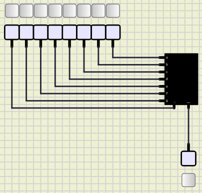
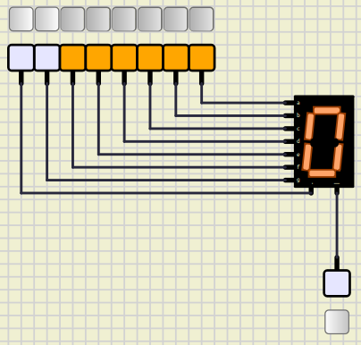
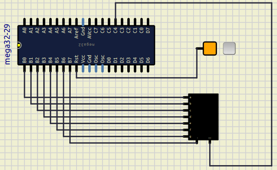

# Session 2: 7segment, counter

## Goal


### bonus point

* Add a led to the board that turns on when the number reaches to `0`.

## 7segment

7segment is a set of 7 leds that can be used to show numbers and some letters.
Each led is called a segment.
The segments are named from `a` to `g`.
Some 7segments have a dot that is called `dp`.



To put a 7segment on the board on simul ide, we can go to the `Outputs` -> `Leds` -> `7segment`.

## Numbers on 7segment

At first let's put a 7segment on the board and connect all of its pins to fixed voltages like below:



In the image above we have connceted all the pins of the 7segment to the fixed voltages.
In order for the 7segment to work, we should let `-` pin to have a low value.

Now we can make numbers buy turning on and off the segments.
For example if we want to make a number `0`, we should turn on all of the segments except `g` and `dp`.
(make sure that you are in a simulation mode.)
We are having something like below:



Now we can make all the numbers and store them in the format below:

| dp | g | f | e | d | c | b | a |
|----|---|---|---|---|---|---|---|
| 0  | 0 | 1 | 1 | 1 | 1 | 1 | 1 |

## Add ATmega32

Now lets add an ATmega32 to the board.
Then we connect our 7segment to the ATmega32 like the image below:



After doing that we should review and learn some essential concepts,
Then we are ready to write our code.

## Binary in C

To define a binay in C, we can use `0b` prefix.
for example:

```c
int a = 0b1010; // a = 10, 2^3 + 2^1 = 8 + 2 = 10
```

## Hex in C

To define a hex in C, we can use `0x` prefix.
For example:

```c
int a = 0x21; // a = 33, 2^5 + 2^0 = 32 + 1 = 33 
```

## DDR

DDR stands for Data Direction Register.
We can use this register to define if a pin is an input or an output.
For example:

```c
DDRA = 0b00000001; // A0 is output and others are input
```

## PORT

PORT is used to set the value of a pin.
It only works when the pin is an output.
For example:

```c
PORTA = 0b00000001; // A0 is high and others are low
```

## PIN

PIN is used to read the value of a pin.
It only works when the pin is an input.
For example:

```c
int a = PINA; 
```

## Implementation

Now we know how to define a binary and a hex in C.
We can define the numbers in binary and write a code that shows them on the 7segment.

## Add an LED

If you add an LED to the board and connect it to the ATmega32, you will have a bonus point.

## Run it on the board

To run our code on the board, we should make some adjusments.
In the board that we have, 7segment leds will turn on when we put
`0` on their related pin which is quite opposite of what we have made
in the simulation.
In order to fix this issue, the only thing that we should do is to
put a negative (`~`) before the values that we have calulated.
For example if we have `0b00111111` for making `0` on 7segment,
we should change it to `~0b00111111` which is equal to `0b11000000`.

Another thing that we should consider when we are uploading our code
to the board is that, `JP1` which is related to the 7segments should not
be on the `on` position.
