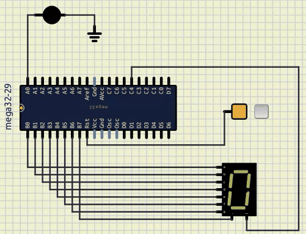

# Session 2

## Goal




### bounus point

* Add a led to the board that turns on when the number reaches to `0`.

## 7segment

## Numbers on 7segment

## Add ATmega32

## Binary in C

To define a binay in C, we can use `0b` prefix.
for example:

```c
int a = 0b1010; // a = 10, 2^3 + 2^1 = 8 + 2 = 10
```

## Hex in C

To define a hex in C, we can use `0x` prefix.
For example:

```c
int a = 0x21; // a = 33, 2^5 + 2^0 = 32 + 1 = 33 
```

## DDR

DDR stands for Data Direction Register.
We can use this register to define if a pin is an input or an output.
For example:

```c
DDRA = 0b00000001; // A0 is output and others are input
```

## PORT

PORT is used to set the value of a pin.
It only works when the pin is an output.
For example:

```c
PORTA = 0b00000001; // A0 is high and others are low
```

## PIN

PIN is used to read the value of a pin.
It only works when the pin is an input.
For example:

```c
int a = PINA; 
```
