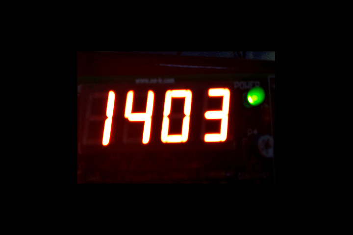
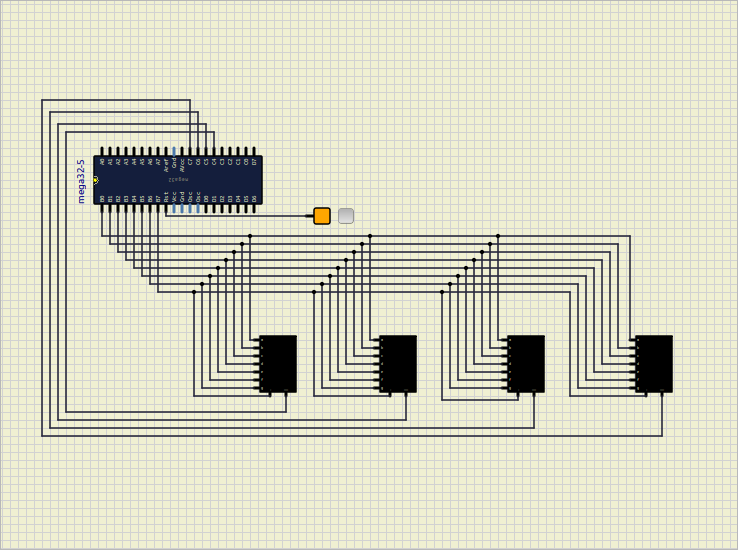

# Session 3: multiple 7segments

## Goal




## Bonus


## Shift

We can shift a number, multiple times like below:

```c
number << how_many
```

for example:

```c
int a = 0b10; // 2
int b = 2;

int c = a << b; 
// c = 8

```

## Change only the value of one index

So that we know with shift we can only change one index
of a number like below.

```c
number |= 1 << which_index;
```

For example:

```c
int a = 0b00100010; // 34
int b = 2;

a |= 1 << b; // 38
```

Another example with `PORTB`:

```c
PORTB |= 1 << 2;
```

To make a value of a certain index of a number,
we can use a code like this.

```c
PORTB &= ~(1 << 3);
// 1 << 2 == 0b100
// ~(1 << 2) == 0b011
```

## Conecting multiple 7segments

In the previous session, we have learned how to connect one 7segment to the
microcontroller.
To connect multiple 7segments, we have different options.
One of the options is to connect the 7segments pins to different pins of the
microcontroller.
For example if we connected the first 7segment to `PORTB` and `COM` to `PORTC.4`,
we connect the other 7segment to `PORTD` and `COM` to `PORTC.5`.
But this way is not the preferable way of doing that.
It occupies a lot of pins of the microcontroller.

The way that is normally used is to connect all the pins of the 7segments to the
same pins of the microcontroller and connect the `COM` pins to different pins of
it.
An example of it shows below:



As you can see on the picture above, all the pins of the 7segments are connected
to the `PORTB` of the microcontroller.
The `COM` pins are connected to the `PORTC.4`,`PORTC.5`, `PORTC.6` and `PORTC.7` of the microcontroller.
In this way we don't occupy so many pins of the microcontroller also we can generate different
numbers on the 7segments at the same time.

## Show a number on one 7segment

To show a number on one 7segment, we can simply put its respective `COM` to `0`.
For example to show a number on the first 7segment we can have something like this:

```c
PORTC = 0b11101111;
```

## Show numbers simultaneously

To show different numbers on different 7segments at the same time, we use a trick.
For human eyes, if we change the numbers very fast, it seems like they are shown at the same time (for example: 2ms).
For example if we want to show `8` and `2` on the first two 7segments, we can use the code below:

```c
PORTC = 0b11101111;
PORTB = 0b00111111; // 8
delay(2);

PORTC = 0b11011111;
PORTB=0b01011011, // 2
delay(2);
```

If we put the code above on the loop function, we can see `8` and `2` on the 7segments at the same time.

## Define a function to show a number on a 7segment

So we can define a function to show a number on a 7segment like below:

```c
void write_number(int number, int index)
{
    PORTC = 0xFF & ~(1 << (index + 4));
    PORTB = numbers[number];
    delay(2);
}
```

* `number`: number that we want to show: 0 to 9
* `index`: index of the 7segment that we want to show the number: 0 to 3

As you can see we wanted an specefic 7segment to turn on regarding to its index.
To do so we wrote the code `PORTC = 0xFF & ~(1 << (index + 4))`.
For example, if we put `index` to `1`, `PORTC` will be `0b11011111` and the second 7segment will turn on.
