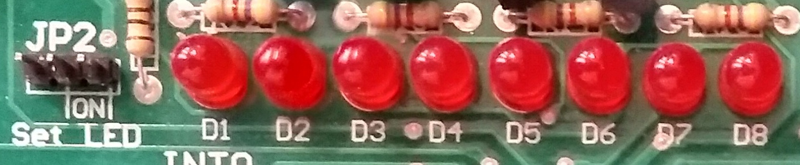

# Session 4: LED and Interrupts

## Goal


## Bonus point

`interrupt0`.
`Dance`.

## LEDs

As you can see in the picture below **LEDs** in `nsk108` can
be controlled by jumper in `JP2`.



In the table below, you can see which one is connected to which pin of `PORTB`.

| d1      | d2      | d3      | d4      | d5      | d6      | d7      | d8      |
|---------|---------|---------|---------|---------|---------|---------|---------|
| PORTB.7 | PORTB.6 | PORTB.5 | PORTB.4 | PORTB.3 | PORTB.2 | PORTB.1 | PORTB.0 |

:::{note}
To turn a LED on, we should put `1` on it
and to turn it off we should put `0` on it.
:::

## Shift

We can shift a number, multiple times like below:

```c
number << how_many
```

for example:

```c
int a = 0b10; // 2
int b = 2;

int c = a << b; 
// c = 8

```

## Change only the value of one index

So that we know with shift we can only change one index
of a number like below.

```c
number |= 1 << which_index;
```

For example:

```c
int a = 0b00100010; // 34
int b = 2;

a |= 1 << b; // 38
```

Another example with `PORTB`:

```c
PORTB |= 1 << 2;
```

To make a value of a certain index of a number,
we can use a code like this.

```c
PORTB &= ~(1 << 3);
// 1 << 2 == 0b100
// ~(1 << 2) == 0b011
```

## Interrupt

Interrupt is a special signal.
It tells the microcontroller to stop (halt)
what he is doing right now and execute some
special code.
This special code is in a `Interrupt Service Routine Function`.

| Interrupt0 | Interrupt1 | Interrupt2 |
|------------|------------|------------|
| PORTD2     | PORTD3     | PORTB2     | 

### `GICR`

`GICR` stands for `General Interrupt Control Register`.

| bit           | 7    | 6    | 5    | 4 | 3 | 2 | 1     | 0    | 
|---------------|------|------|------|---|---|---|-------|------|
| name          | INT1 | INT0 | INT2 | - | - | - | IVSEL | IVCE | 
| Read/Write    | R/W  | R/W  | R/W  | R | R | R | R/W   | R/W  | 
| initial value | 0    | 0    | 0    | 0 | 0 | 0 | 0     | 0    | 

To enable `Interrupt1` to work we put the value of the 7th index of `GICR` to 1,
to do so we can use a code like this:

```c
GICR |= 1 << INT1;
```

### `MCUCR`

`MCUCR` stands for `MCU Control Register`.
`ISC` stands for `Interrupt Sense Control`.
It basically controls when should an Interrupt occur.
As you can see we can config our Interrupt to happen in different situations.

| bit           | 7   | 6   | 5   | 4   | 3     | 2     | 1     | 0     | 
|---------------|-----|-----|-----|-----|-------|-------|-------|-------|
| name          | SE  | SM2 | SM1 | SM0 | ISC11 | ISC10 | ISC01 | ISC00 | 
| Read/Write    | R/W | R/W | R/W | R/W | R/W   | R/W   | R/W   | R/W   | 
| initial value | 0   | 0   | 0   | 0   | 0     | 0     | 0     | 0     | 

| ISC11 | ISC10 | Description                                                |
|-------|-------|------------------------------------------------------------|
| 0     | 0     | The low level of INT1 generates an interrupt request.      |
| 0     | 1     | Any logical change on INT1 generates an interrupt request. |
| 1     | 0     | The falling edge of INT1 generates an interrupt request.   |
| 1     | 1     | The rising edge of INT1 generates an interrupt request.    |

| ISC01 | ISC00 | Description                                                |
|-------|-------|------------------------------------------------------------|
| 0     | 0     | The low level of INT0 generates an interrupt request.      |
| 0     | 1     | Any logical change on INT0 generates an interrupt request. |
| 1     | 0     | The falling edge of INT0 generates an interrupt request.   |
| 1     | 1     | The rising edge of INT0 generates an interrupt request.    |

### `MCUCSR`

`MCUCSR` stands for `MCU Control and Status Register`.
The only thing that we should know in this table is `ISC2`.
This register can handle how `interrup2` will be triggerd
(Falling edge or rising edge).

| bit           | 7   | 6    | 5 | 4       | 3       | 2       | 1       | 0       | 
|---------------|-----|------|---|---------|---------|---------|---------|---------|
| name          | JTD | ISC2 | - | JTRF    | WDRF    | BORF    | EXTRF   | PORF    | 
| Read/Write    | R/W | R/W  | R | R/W     | R/W     | R/W     | R/W     | R/W     | 
| initial value | 0   | 0    | 0 | depends | depends | depends | depends | depends | 

### `GIFR`

`GIFR` stands for `General Interrupt Flag Register`.
When an interrupt happens, a corresponding index of
this register will be set to 1.
If we write 1 to any of the indexes manually, we
can clear the flag.

| bit           | 7     | 6     | 5     | 4 | 3 | 2 | 1 | 0 | 
|---------------|-------|-------|-------|---|---|---|---|---|
| name          | INTF1 | INTF0 | INTF2 | - | - | - | - | - | 
| Read/Write    | R/W   | R/W   | R/W   | R | R | R | R | R | 
| initial value | 0     | 0     | 0     | 0 | 0 | 0 | 0 | 0 | 

### `#asm`

`#asm` is used to write a direct `assembly` command.
We need only 2 commands.
One that **enables** global interrupts and one that
**disables** them.

#### `sei`

`sei` enables the global interrupts.
We can use it like the code below:

```c
#asm(sei)
```

#### `cli`

`cli` disables the global interrupts.
We can use it like the code below:

```c
#asm(cli)
```

### Interrupt Service Routine (ISR) function

We can write a `Interrupt Service Routine function` like below:

```c
interrupt [NAME_OF_INTERRUPT] void name(void){

// your code

}
```

For example for `Interrupt1` we can write:

```c
interrupt [EXT_INT1] void ext_int1_isr(void){

// your code

}
```

## Write a counter on LEDs and control them with `Interrupt1`

Now we can write a counter on LEDs which is incrementing until
we press `Interrupt1`.
Then when we press `Interrupt1` again, incrementing continues.
Like the gif in the **Goal** section.

## Time Interrupt

`Time Interrupt` has a timer, when it reaches
to a specific condition, an interrupt would occur.

Atmega32 has 3 main timers.

* `Timer0`: 8-bit
* `Timer1`: 16-bit
* `Timer2`: 8-bit

We will be working with `Timer0`.

### `TIMSK`

`TIMSK` stands for `Timer/Counter Interrupt Mask Register`.
`OCIE` stands for `Output Compare Match Interrupt Enable`.
`TOIE` stands for `Timer/Counter0 Overflow Interrupt Enable`.

| bit           | 7     | 6     | 5      | 4      | 3      | 2     | 1     | 0     | 
|---------------|-------|-------|--------|--------|--------|-------|-------|-------|
| name          | OCIE2 | TOIE2 | TICIE1 | OCIE1A | OCIE1B | TOIE1 | OCIE0 | TOIE0 | 
| Read/Write    | R/W   | R/W   | R/W    | R/W    | R/W    | R/W   | R/W   | R/W   | 
| initial value | 0     | 0     | 0      | 0      | 0      | 0     | 0     | 0     | 

We need to compare the value of timer with `OCR0` register so we should
write a code like below:

```c
TIMSK |= 1 << OCIE0
```

### `TCCR0`

`TCCR0` stands for `Timer/Counter Clock Sources`.
To work with `Timer0`, we should initialize some indexes of this register.
Table below shows all the available indexes.

| bit           | 7    | 6     | 5     | 4     | 3     | 2    | 1    | 0    | 
|---------------|------|-------|-------|-------|-------|------|------|------|
| name          | FOC0 | WGM00 | COM01 | COM00 | WGM01 | CS02 | CS01 | CS00 |
| Read/Write    | R/W  | R/W   | R/W   | R/W   | R/W   | R/W  | R/W  | R/W  | 
| initial value | 0    | 0     | 0     | 0     | 0     | 0    | 0    | 0    | 

| WGM00 | 	WGM01 | 	Timer0 mode selection bit         |
|-------|--------|------------------------------------|
| 0	    | 0      | Normal                             |
| 0	    | 1	     | CTC (Clear timer on Compare Match) |
| 1	    | 0      | PWM, Phase correct                 |
| 1	    | 1	     | Fast PWM                           |

We need to compare with the `OCR0` register, so we set
`WMG01` index to 1.

```c
TCCR0 |= 1 << WMG01
```

| CS02 | CS01 | CS00 | Description                                             |
|------|------|------|---------------------------------------------------------|
| 0    | 0    | 0    | No clock source (Timer/Counter stopped).                |
| 0    | 0    | 1    | clkI/O/(No prescaling)                                  |
| 0    | 1    | 0    | clkI/O/8 (From pre-scaler)                              |
| 0    | 1    | 1    | clkI/O/64 (From pre-scaler)                             |
| 1    | 0    | 0    | clkI/O/256 (From pre-scaler)                            |
| 1    | 0    | 1    | clkI/O/1024 (From pre-scaler)                           |
| 1    | 1    | 0    | External clock source on T0 pin. Clock on falling edge. |
| 1    | 1    | 1    | External clock source on T0 pin. Clock on rising edge.  |

now we should our `pre-scaler` which controls how much frequency should reach to
the `timer0`.
For example if our chip is running with `8Mhz`, if we put our
`pre-scaler` value to 8, the `timer0` would get `1Mhz` of frequency.
We can control `pre-scaler` as shown in the table above.
For example, the code below puts the pre-scaler to `1024`.

```c
TCCR0 |= 1 << CS00;
TCCR0 |= 1 << CS02;
```

### `TCNT0`

`TCNT` stands for `Timer/Counter Register`.
Any time a clock reaches the timer, this increments.
It has only 8bits so it can only reach to `255`.

### `OCR0`

`OCR` stands for `Output Compare Register`.
The value of `TCNT0` gets compare with `OCR0`.
If `TCNT0` reaches the value of `OCR0`,
an interrupt would occur.


