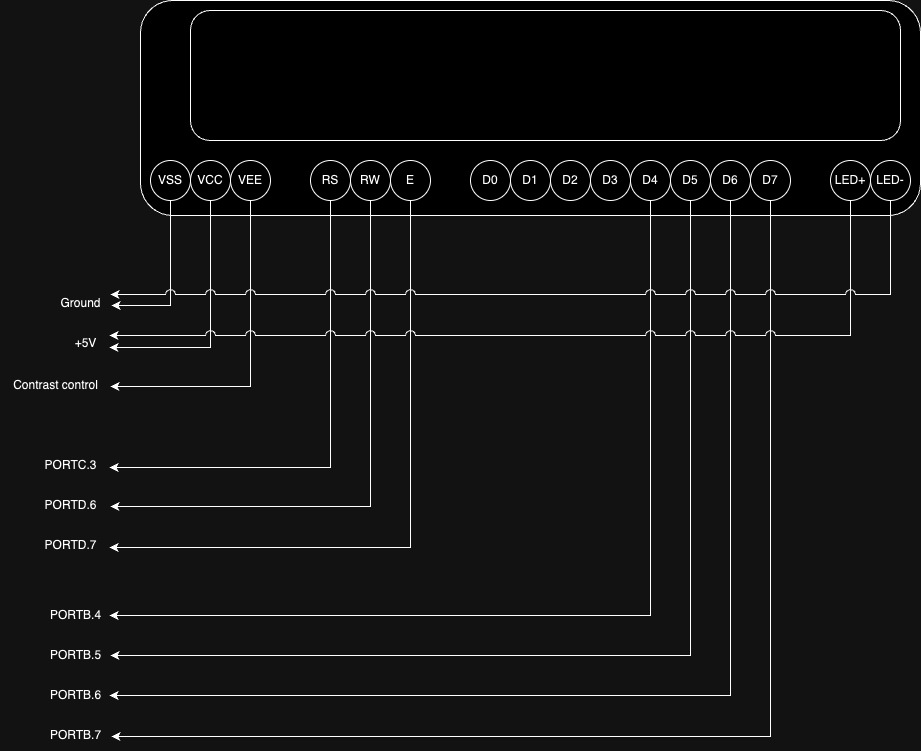
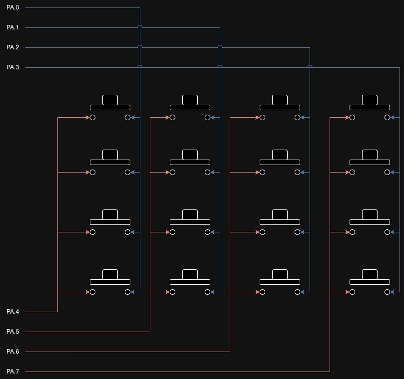
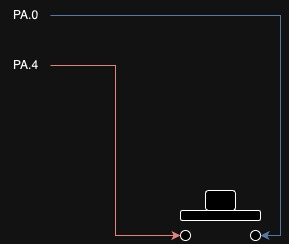
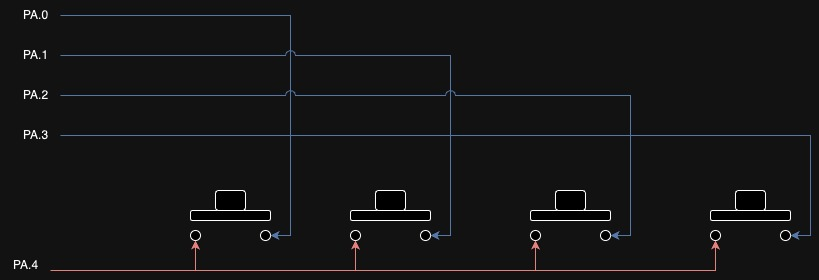

# Session 5: LCD and keypad

## Goal

Show the input of keypad on LCD.

## Bonus point

Show a 4 digit number on 7segements.

## LCD

LCD is used to write parameters and status.
We have a `16x2 LCD` (16 columns and 2 rows).
It has 16-pins.

| VSS    | VCC | VEE              |
| ------ | --- | ---------------- |
| Ground | 5V+ | Contrast Control |


| RS              | RW           | E      |
| --------------- | ------------ | ------ |
| Register select | Read / Write | Enable |


| D0         | D1         | D2         | D3         | D4         | D5         | D6         | D7         |
| ---------- | ---------- | ---------- | ---------- | ---------- | ---------- | ---------- | ---------- |
| Data pin 0 | Data pin 1 | Data pin 2 | Data pin 3 | Data pin 4 | Data pin 5 | Data pin 6 | Data pin 7 |


| LED+    | LED-       |
| ------- | ---------- |
| LED 5V+ | LED Ground |



### LCD library and header file

For `NSK108` the have provided us a head file and a library.

* `108LCD.h`
* `108LCD.lib`

We can use them in our project, simply by copying them into
the main directory.
Then import it using the code below:

```c
#include <108lcd.h>
```

This library has 6 functions, that we are going to explain about them more.

### `lcd_init`

initializes our `LCD`.
Sets `DDR`s and `PORT`s required for the `LCD` to function.

Synopsis:

```c
lcd_init(unsigned char lcd_columns);
```

Arguments:

* `lcd_columns`: number of columns that we want to use

Example:

```c
lcd_init(16);
```

### `lcd_gotoxy`

Goes to a position on `LCD`.

Synopsis:

```c
lcd_gotoxy(unsigned char x, unsigned char y);
```

Arguments:

* `x`: Column position
* `y`: Row position

Example:

```c
lcd_gotoxy(5, 1);
```

### `lcd_putchar`

Puts a `charachter` in a current position of the `LCD`.

Synopsis:

```c
lcd_putchar(char c);
```

Arguments:

* `c`: Character that we want to write on the `LCD` 

Example:

```c
lcd_putchar('p');
```

### `lcd_puts`

Puts a `string` in a current position of the `LCD`.
If it exceeds, goes back to the `0` column.

Synopsis:

```c
lcd_puts(char *str);
```

Arguments:

* `str`: String that we want to write on the `LCD` 

Example:

```c
lcd_puts("hello");
```

### `lcd_putsf`


Puts a `string` in a current position of the `LCD` that is in the flash.
If it exceeds, goes back to the `0` column.

Synopsis:

```c
lcd_puts(char flash *str);
```

Arguments:

* `str`: String that we want to write on the `LCD` 

Example:

```c
lcd_putsf("hello");
```

### `lcd_clear`


Clears the `LCD`

Synopsis:

```c
lcd_clear();
```

Example:

```c
lcd_putsf();
```

## `PIN`

We use `PIN` variable to read data of a `pin`.

For example:

```c
char x = PINA;
```

## Keypad



As you can see on the image above, the way that
each key is connected to `ATmega32` is shown.

| col0 | col1 | col2 | col3 | row0 | row1 | row2 | row3 |
| ---- | ---- | ---- | ---- | ---- | ---- | ---- | ---- |
| PA.0 | PA.1 | PA.2 | PA.3 | PA.4 | PA.5 | PA.6 | PA.7 |


:::{important}
We put `1` in all the pins.
:::

### Detect one key (row0, col0) 

In order to detect which key is pressed we start with one
key.



As you can see on the image above
if I put `0` in `PORTA.4`:
* If the key is pressed: `PINA.0` = 0
* If the key is **not** pressed: `PINA.0` = 1

### Detect a row of keys (row0)

Now we try to detect a row of keys.



As you can see on the image above
if I put `0` in `PORTA.4`:
* If the key in `col0` is pressed: `PINA.0` = 0
* If the key in `col1` is pressed: `PINA.1` = 0
* If the key in `col2` is pressed: `PINA.2` = 0
* If the key in `col3` is pressed: `PINA.3` = 0

### Detect all keys

To detect all keys we can run a for on 
`PORTA.4` to `PORTA.7`