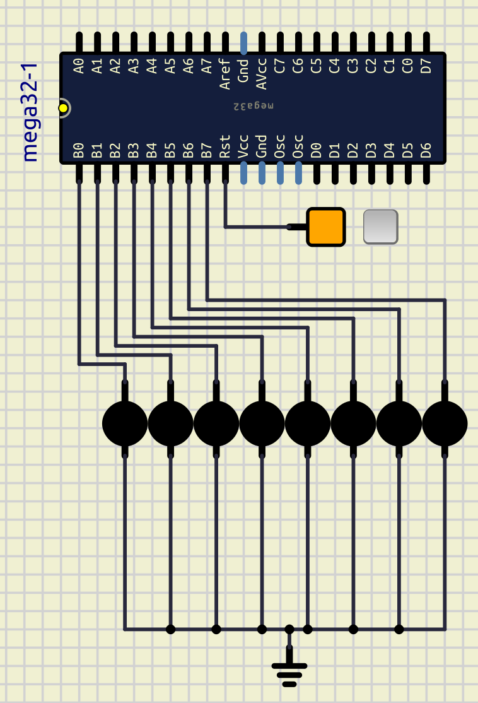

# Session 5: External Interrupt

## Goal


### Bonus


* Patern above
* Interrupt0: stop whenever it's pressed

## Connect LEDs

Let's first connect 8 LEDs to the `PORTB` of an ATmega32.
We can do that like below:



## Interrupt

Interrupt is a special signal.
It tells the microcontroller to stop (halt)
what he is doing right now and execute some
special code.
This special code is in a `Interrupt Service Routine Function`.

| Interrupt0 | Interrupt1 | Interrupt2 |
| ---------- | ---------- | ---------- |
| PORTD2     | PORTD3     | PORTB2     |

### `GICR`

`GICR` stands for `General Interrupt Control Register`.

| bit           | 7    | 6    | 5    | 4   | 3   | 2   | 1     | 0    |
| ------------- | ---- | ---- | ---- | --- | --- | --- | ----- | ---- |
| name          | INT1 | INT0 | INT2 | -   | -   | -   | IVSEL | IVCE |
| Read/Write    | R/W  | R/W  | R/W  | R   | R   | R   | R/W   | R/W  |
| initial value | 0    | 0    | 0    | 0   | 0   | 0   | 0     | 0    |

To enable `Interrupt1` to work we put the value of the 7th index of `GICR` to 1,
to do so we can use a code like this:

```c
GICR |= 1 << INT1;
```

### `MCUCR`

`MCUCR` stands for `MCU Control Register`.
`ISC` stands for `Interrupt Sense Control`.
It basically controls when should an Interrupt occur.
As you can see we can config our Interrupt to happen in different situations.

| bit           | 7   | 6   | 5   | 4   | 3     | 2     | 1     | 0     |
| ------------- | --- | --- | --- | --- | ----- | ----- | ----- | ----- |
| name          | SE  | SM2 | SM1 | SM0 | ISC11 | ISC10 | ISC01 | ISC00 |
| Read/Write    | R/W | R/W | R/W | R/W | R/W   | R/W   | R/W   | R/W   |
| initial value | 0   | 0   | 0   | 0   | 0     | 0     | 0     | 0     |

| ISC11 | ISC10 | Description                                                |
| ----- | ----- | ---------------------------------------------------------- |
| 0     | 0     | The low level of INT1 generates an interrupt request.      |
| 0     | 1     | Any logical change on INT1 generates an interrupt request. |
| 1     | 0     | The falling edge of INT1 generates an interrupt request.   |
| 1     | 1     | The rising edge of INT1 generates an interrupt request.    |

| ISC01 | ISC00 | Description                                                |
| ----- | ----- | ---------------------------------------------------------- |
| 0     | 0     | The low level of INT0 generates an interrupt request.      |
| 0     | 1     | Any logical change on INT0 generates an interrupt request. |
| 1     | 0     | The falling edge of INT0 generates an interrupt request.   |
| 1     | 1     | The rising edge of INT0 generates an interrupt request.    |

### `MCUCSR`

`MCUCSR` stands for `MCU Control and Status Register`.
The only thing that we should know in this table is `ISC2`.
This register can handle how `interrup2` will be triggerd
(Falling edge or rising edge).

| bit           | 7   | 6    | 5   | 4       | 3       | 2       | 1       | 0       |
| ------------- | --- | ---- | --- | ------- | ------- | ------- | ------- | ------- |
| name          | JTD | ISC2 | -   | JTRF    | WDRF    | BORF    | EXTRF   | PORF    |
| Read/Write    | R/W | R/W  | R   | R/W     | R/W     | R/W     | R/W     | R/W     |
| initial value | 0   | 0    | 0   | depends | depends | depends | depends | depends |

### `GIFR`

`GIFR` stands for `General Interrupt Flag Register`.
When an interrupt happens, a corresponding index of
this register will be set to 1.
If we write 1 to any of the indexes manually, we
can clear the flag.

| bit           | 7     | 6     | 5     | 4   | 3   | 2   | 1   | 0   |
| ------------- | ----- | ----- | ----- | --- | --- | --- | --- | --- |
| name          | INTF1 | INTF0 | INTF2 | -   | -   | -   | -   | -   |
| Read/Write    | R/W   | R/W   | R/W   | R   | R   | R   | R   | R   |
| initial value | 0     | 0     | 0     | 0   | 0   | 0   | 0   | 0   |

### sei

`sei` enables the global interrupts.
We can use it like the code below:

```cpp
sei()
```

### cli

`cli` disables the global interrupts.
We can use it like the code below:

```c
cli()
```

## Write a counter on LEDs and control them with `Interrupt1`

Now we can write a counter on LEDs which is incrementing until
we press `Interrupt1`.
Then when we press `Interrupt1` again, incrementing continues.
Like the gif in the **Goal** section.
