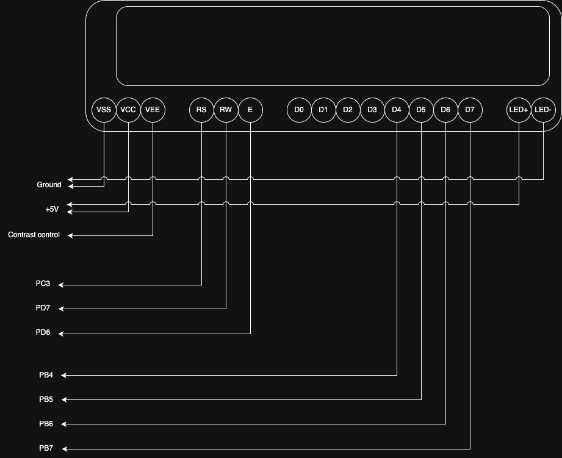
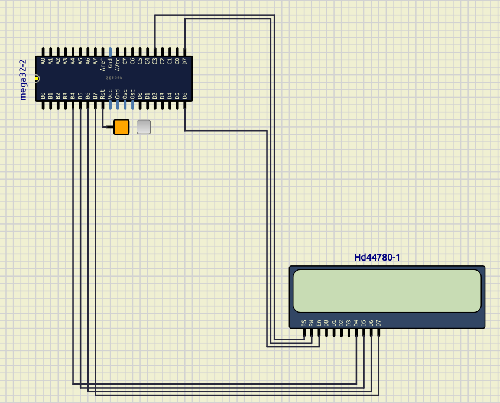
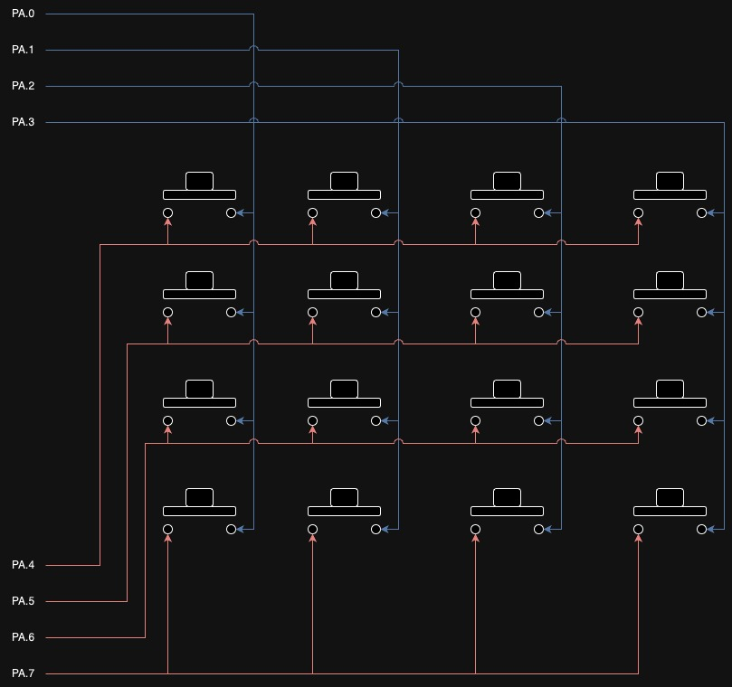
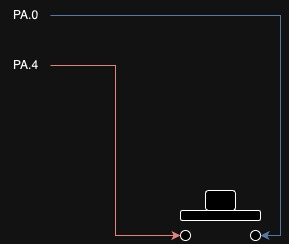
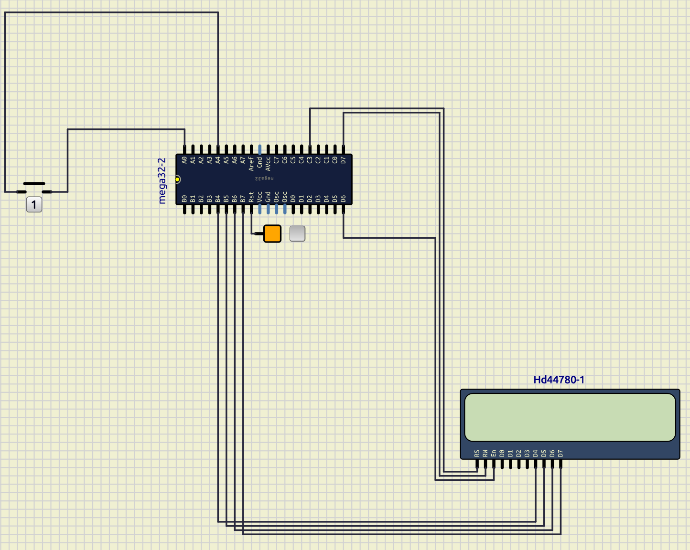
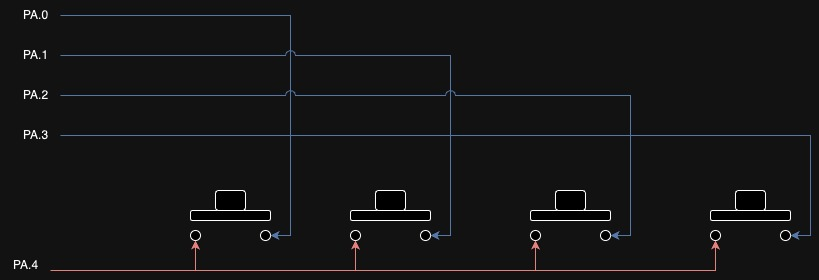
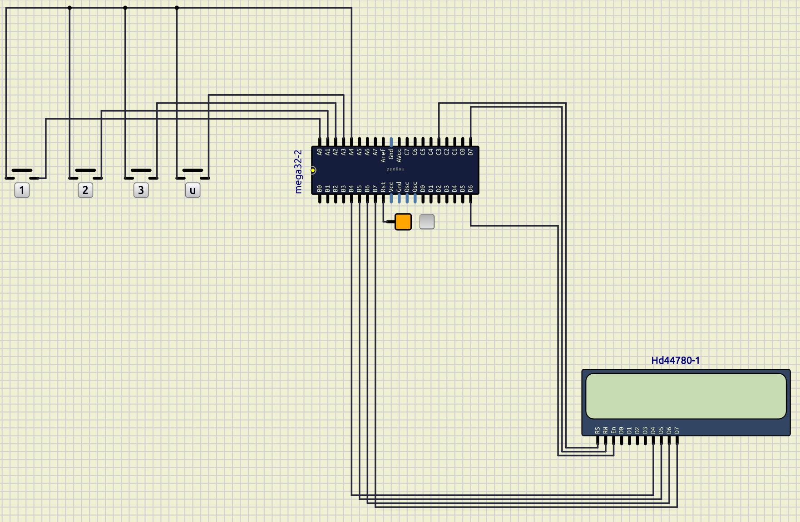

# Session 5: LCD and KeyPad

## Goal


### Bonus point

* enter password
* type `*` instead of actual character
* `D`: clear the input
* `E`: submit your password

## LCD

LCD is used to write parameters and status.
We have a `16x2 LCD` (16 columns and 2 rows).
It has 16-pins.

| VSS    | VCC | VEE              |
| ------ | --- | ---------------- |
| Ground | 5V+ | Contrast Control |

| RS              | RW           | E      |
| --------------- | ------------ | ------ |
| Register select | Read / Write | Enable |

| D0         | D1         | D2         | D3         | D4         | D5         | D6         | D7         |
| ---------- | ---------- | ---------- | ---------- | ---------- | ---------- | ---------- | ---------- |
| Data pin 0 | Data pin 1 | Data pin 2 | Data pin 3 | Data pin 4 | Data pin 5 | Data pin 6 | Data pin 7 |

| LED+    | LED-       |
| ------- | ---------- |
| LED 5V+ | LED Ground |



## Connect LCD on SimulIDE

In `SimulIDE` we can select an LCD from `/outputs/displays/HD44780` and connect it to the `ATmega32`.
We connect the pins like this:

* RS PC3
* RW PD7
* EN PD6
* D4 PB4
* D5 PB5
* D6 PB6
* D7 PB7

So the result would be like the image below:



### LCD library and header file

For `LCD` library, We have a directory called `lcd_library` which have two files:

* [`lcd_library.h`](../lib/lcd_library/lcd_library.h)
* [`lcd_library.cpp`](../lib/lcd_library/lcd_library.cpp)

To use them in our project we shoud copy the whole directory of `lcd_library`
to the lib directory of our PlatformIO project.
Then we are going to be able to import it using the code below:

```cpp
#include <lcd_library.h>
```

This library has 6 functions, that we are going to explain about them more.

### `lcd_init`

initializes our `LCD`.
Sets `DDR`s and `PORT`s required for the `LCD` to function.

Synopsis:

```c
void lcd_init();
```

Example:

```c
lcd_init();
```

### `lcd_gotoxy`

Goes to a position on `LCD`.

Synopsis:

```c
void lcd_gotoxy(unsigned char row, unsigned char col)
```

Arguments:

* `row`: row position
* `col`: column position

Example:

```c
lcd_gotoxy(1, 5);
```

### `lcd_putchar`

Puts a `charachter` in a current position of the `LCD`.

Synopsis:

```c
void lcd_putchar(unsigned char data);
```

Arguments:

* `data`: Character that we want to write on the `LCD`

Example:

```c
lcd_putchar('p');
```

### `lcd_puts`

Puts a `string` in a current position of the `LCD`.
If it exceeds, goes back to the `0` column.

Synopsis:

```c
void lcd_puts(const char *str);
```

Arguments:

* `str`: String that we want to write on the `LCD`

Example:

```c
lcd_puts("hello");
```

### `lcd_clear`

Clears the `LCD`

Synopsis:

```cpp
void lcd_clear();
```

Example:

```cpp
lcd_clear();
```

### `lcd_commad`

Sends a command to the `LCD`.

Synopsis:

```cpp
void lcd_command(unsigned char cmd);
```

Arguments:

* `cmd`: Command that we want to send to the `LCD`

Example:

```cpp
// to clear the display:
lcd_command(0x01);
```

## `PIN`

We use `PIN` variable to read data of a `pin`.

For example:

```c
char x = PINA;
```

## Keypad



As you can see on the image above, the way that
each key is connected to `ATmega32` is shown.

| col0 | col1 | col2 | col3 | row0 | row1 | row2 | row3 |
| ---- | ---- | ---- | ---- | ---- | ---- | ---- | ---- |
| PA.0 | PA.1 | PA.2 | PA.3 | PA.4 | PA.5 | PA.6 | PA.7 |

:::{important}
We put `1` in all the pins.
:::

### Detect one key (row0, col0)

In order to detect which key is pressed we start with one
key.



As you can see on the image above
if I put `0` in `PORTA.4`:

* If the key is pressed: `PINA.0` = 0
* If the key is **not** pressed: `PINA.0` = 1

The simulation would be like below:



### Detect a row of keys (row0)

Now we try to detect a row of keys.



As you can see on the image above
if I put `0` in `PORTA.4`:

* If the key in `col0` is pressed: `PINA.0` = 0
* If the key in `col1` is pressed: `PINA.1` = 0
* If the key in `col2` is pressed: `PINA.2` = 0
* If the key in `col3` is pressed: `PINA.3` = 0

The simulation would be like below:



### Detect all keys

To detect all keys we can run a for on
`PORTA.4` to `PORTA.7`
