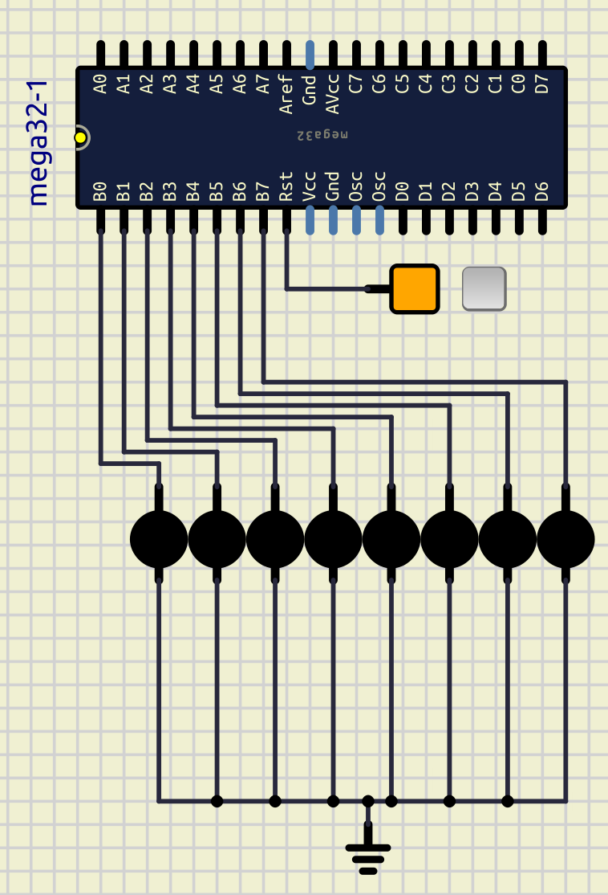
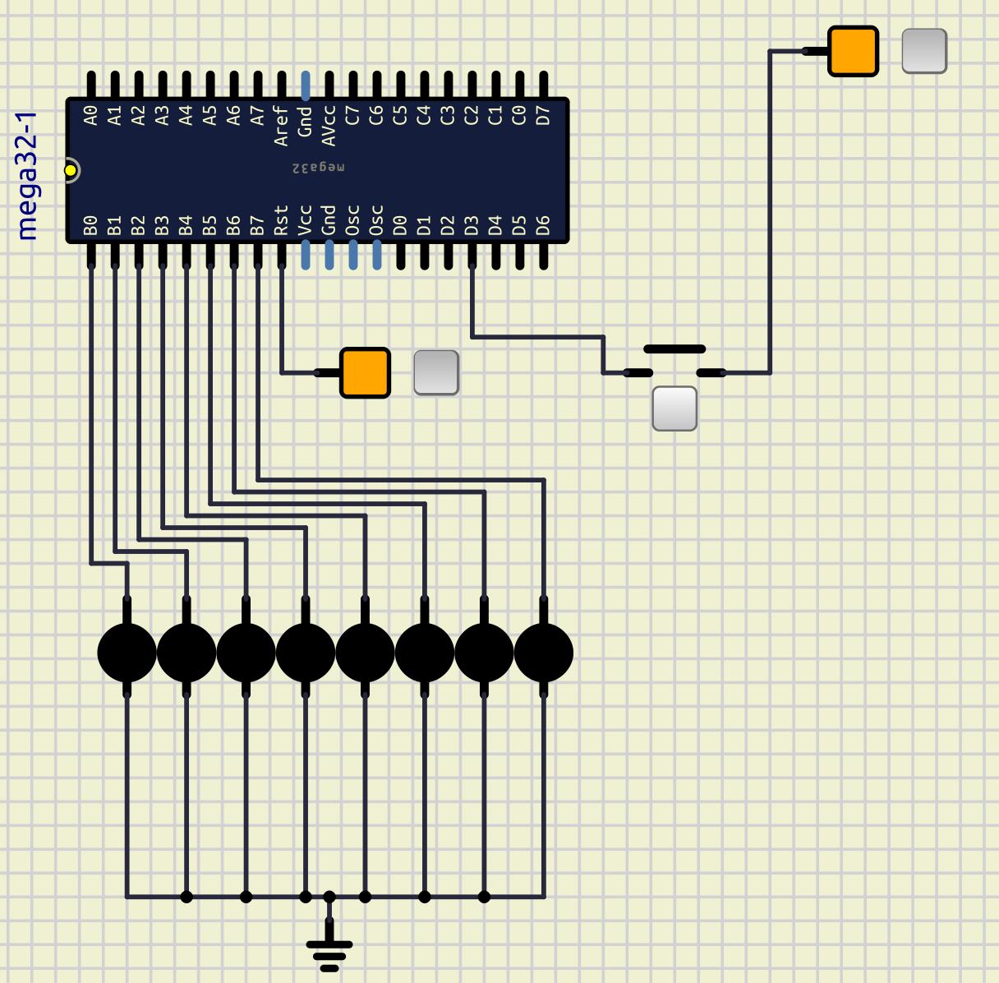

# Session 7: External Interrupt

## Goal


### Bonus


* Patern above
* Interrupt0: stop whenever it's pressed

## Connect LEDs

Let's first connect 8 LEDs to the `PORTB` of an ATmega32.
We can do that like below:



Now, write a code to turn on all the LEDs.
After that let's talk about interrupt.

## Interrupt

Interrupt is a special signal.
It tells the microcontroller to stop (halt)
what he is doing right now and execute some
special code.
This special code is in a `Interrupt Service Routine Function`.

In `ATmega32` we have 3 external interrupts
which are connected to their special pins.
Those pins are shown in the table below:

| Interrupt0 | Interrupt1 | Interrupt2 |
| ---------- | ---------- | ---------- |
| PORTD2     | PORTD3     | PORTB2     |

In this session, we will be working on
`Interrupt0` and `Interrupt1`.

To use these interrupts we need 3 steps:

1. Tell microcontroller which interrupt we want to use
2. Enable global interrupts
3. Write the function

Imagine you are at your house.
There is a switch at the beggining of your house
that has a control on whether your house has electricity
or not.
This switch is like our second step.
Now with that switch on, you can turn on the light of
each specific room that you want.
Each specific room is like our first step.

Now let's explain how to tell microcontroller
to do each of those steps.

## Step 1 (Enable specific Interrupt)

To enable an specific interrupt we use a
Register in `ATmega32` called `GICR`.
`GICR` stands for `General Interrupt Control Register`.
Each bit on `GICR` does a specific task.
We only need to change bit `7` and `6`,
To tell the microcontroller if we want to enable
`Interrupt1` or `Interrupt2`.
The complete table is shown below:

| bit           | 7    | 6    | 5    | 4   | 3   | 2   | 1     | 0    |
| ------------- | ---- | ---- | ---- | --- | --- | --- | ----- | ---- |
| name          | INT1 | INT0 | INT2 | -   | -   | -   | IVSEL | IVCE |
| Read/Write    | R/W  | R/W  | R/W  | R   | R   | R   | R/W   | R/W  |
| initial value | 0    | 0    | 0    | 0   | 0   | 0   | 0     | 0    |

To enable `Interrupt1` to work we put the value of the 7th index of `GICR` to 1,
to do so we can use a code like this:

```c
GICR |= 1 << INT1;
```

In the code above `INT1` is equal to `7`.
In embedded programming to make the code more clean also
to help us not memorizing each bit, they have made some
special constants.
`INT1` is one of them.
Respectively, we have `INT0` for `interrupt0`

## Step 2 (enable global interrupts)

To enable global the interrupts, there is a function called
`sei()`.
So the only thing that we have to do is to call this function.
Also to disable global interrupts, we can use a function called
`cli()`.

## Step 3 (Write a fucntion)

To write a function for our specefic interrupt
we can use the code below:

```cpp
ISR(INT1_vect){
    // your code here
}
```

* `INT0_vect`: for intrrupt 0
* `INT1_vect`: for intrrupt 1

The code that you write in this function
will be executed, if the `interrupt1` has happened.
For example let's write our function like below:

```cpp
ISR(INT1_vect){
    PORTB = ~PORTB;
}
```

In the code above, anytime `interrupt1` happens,
the value of `PORTB` will be reverted.

Now, we are ready to connect our interrupt to our
microcontroller.

## Connect Interrupt

To connect an interrupt, we need to add a **switch**.
Connect one part of the switch to the `PD3` and the other
part to a **fixed voltage** that is **on**.
Some thing like below:



## Test our code on simulation

Now we have a code like below:

```cpp
#include <Arduino.h>

ISR(INT1_vect)
{
  PORTB = ~PORTB;
}

void setup()
{
  DDRB = 0xFF;

  GICR |= (1 << INT1);

  sei();
}

void loop()
{
}
```

In the code above we have implemented everything that we said before.
And we expect that, every time that we apply an interrupt,
LEDs toggle.
If they are on, they should become off and vice versa.

But the output would be somethings like below:


As you can see, anytime I press a key the output would be random.
To fix this issue we should know another registed called `MCUCR`.

### `MCUCR`

`MCUCR` stands for `MCU Control Register`.
`ISC` stands for `Interrupt Sense Control`.
It basically controls when should an Interrupt occur.
As you can see we can config our Interrupt to happen in different situations.

| bit           | 7   | 6   | 5   | 4   | 3     | 2     | 1     | 0     |
| ------------- | --- | --- | --- | --- | ----- | ----- | ----- | ----- |
| name          | SE  | SM2 | SM1 | SM0 | ISC11 | ISC10 | ISC01 | ISC00 |
| Read/Write    | R/W | R/W | R/W | R/W | R/W   | R/W   | R/W   | R/W   |
| initial value | 0   | 0   | 0   | 0   | 0     | 0     | 0     | 0     |

| ISC11 | ISC10 | Description                                                | figure                                                     |
| ----- | ----- | ---------------------------------------------------------- | ---------------------------------------------------------- |
| 0     | 0     | The low level of INT1 generates an interrupt request.      |  |
| 0     | 1     | Any logical change on INT1 generates an interrupt request. |  |
| 1     | 0     | The falling edge of INT1 generates an interrupt request.   |  |
| 1     | 1     | The rising edge of INT1 generates an interrupt request.    |  |

| ISC01 | ISC00 | Description                                                | figures                                                    |
| ----- | ----- | ---------------------------------------------------------- | ---------------------------------------------------------- |
| 0     | 0     | The low level of INT0 generates an interrupt request.      |  |
| 0     | 1     | Any logical change on INT0 generates an interrupt request. |  |
| 1     | 0     | The falling edge of INT0 generates an interrupt request.   |  |
| 1     | 1     | The rising edge of INT0 generates an interrupt request.    |  |

### Set interrupt request mode

Now we know the problem was because of the interrupt being sent
all the time we were holding the interrupt button, we can fix it.
Know we put our `interrupt1` in the rising edge mode with the code below:

```cpp
MCUCR |= (1 << ISC10);
MCUCR |= (1 << ISC11);
```

After testing our code again the output would be something like below:


As you can see anytime we press the key an interrupt will be sent.

## Write a counter on LEDs and control them with `Interrupt1`

Now we can write a counter on LEDs which is incrementing until
we press `Interrupt1`.
When `Interrupt1` is pressed, it resets and increamention starts
from the begining.

## Add `Interrupt0`

Now add the `Interrupt0` to pause the increament.
And if you want a bonus point do the pattern in the bonus section.

:::{note}
To see all the registers related to Interrupts you can refer to
notes section in this tutorial or you can refer to the `ATmega32` datasheet.
:::
