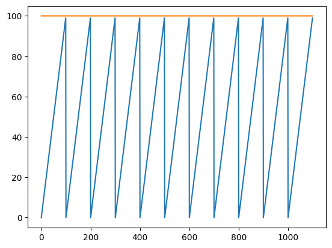

# Session 8: Timer Interrupt

## Goal


* TIMER0: Kight pattern
* TIMER2: Shift pattern
* INT0: Control the speed
* INT1: Stop

## Bonus

* TIMER1: does another pattern

## Connect LEDs and interrupts

Like session_5 we should connect 8 LEDs to `PB`.
We connect two interrupts to `PD2` and `PD3`.
So the result would be something like below:


## Progam a simple shift pattern on LED

First step is to program a simple shift pattern on LED that we learned  
on **session_4**.

## Add external intrrupt to it

Then we add an `External Interupt` to it which we also learned in
**session_4**

## Time Interrupt

`Time Interrupt` has a timer, when it reaches
to a specific condition, an interrupt would occur.

Atmega32 has 3 main timers.

* `Timer0`: 8-bit
* `Timer1`: 16-bit
* `Timer2`: 8-bit

We will be working with `Timer0`.

### How `timer interrupt` works

The `Timer Interrupt` has a counter that, each time a clock reaches it,
it would increase.
We can confing `Timer Interrupt` to send an `Interrupt` in this two
conditions:

* When it overflows
* When it reaches to an specefic number

We can access all of them by some registers.

* Counter: `TCNT`
* Condition: `OCR`

if the mode is on `overflow` there would be an interrupt each time
the counter exceeds 255.
You can see in the image below that every time
we reach 256, an `interrupt` would be sent.


If we put it on `compare` mode, and set `OCR` to 100,
we would have an image like below:


As you can see the image above, still there would be an interrupt
every 256 clock.
We can set a register to prevent that from happening.
If we reach to `OCR` then `TCNT` becomes `0` again.
It would like the image below.



By knowing that we can calulate how many times an interrupt
would be sent.
For example, if our microcontroller works with `8.0Mhz` frequency, which is
`0.125us`,
and we set `OCR` to `100`, we will be having an interrupt
every `12.5us`.

We can control when to send a clock to a `Timer Interrupt` as well.
We call that `pre-scaler`.
`pre-scaler` tells the microcontroller on how many clock of the microcontroller,
`timer` should get a clock.
It can be set only to this values: `1 8 64 256 1024`.
For example, if we set our `pre-scaler` to `8` and our
microcontroller works with `8.0Mhz` frequency,
`timer` will work with `1.0Mhz` frequency.

### `TIMSK`

`TIMSK` stands for `Timer/Counter Interrupt Mask Register`.
`OCIE` stands for `Output Compare Match Interrupt Enable`.
`TOIE` stands for `Timer/Counter0 Overflow Interrupt Enable`.

| bit           | 7     | 6     | 5      | 4      | 3      | 2     | 1     | 0     |
| ------------- | ----- | ----- | ------ | ------ | ------ | ----- | ----- | ----- |
| name          | OCIE2 | TOIE2 | TICIE1 | OCIE1A | OCIE1B | TOIE1 | OCIE0 | TOIE0 |
| Read/Write    | R/W   | R/W   | R/W    | R/W    | R/W    | R/W   | R/W   | R/W   |
| initial value | 0     | 0     | 0      | 0      | 0      | 0     | 0     | 0     |

We need to compare the value of timer with `OCR0` register so we should
write a code like below:

```c
TIMSK |= 1 << OCIE0
```

### `TCCR0`

`TCCR0` stands for `Timer/Counter Clock Sources`.
To work with `Timer0`, we should initialize some indexes of this register.
Table below shows all the available indexes.

| bit           | 7    | 6     | 5     | 4     | 3     | 2    | 1    | 0    |
| ------------- | ---- | ----- | ----- | ----- | ----- | ---- | ---- | ---- |
| name          | FOC0 | WGM00 | COM01 | COM00 | WGM01 | CS02 | CS01 | CS00 |
| Read/Write    | R/W  | R/W   | R/W   | R/W   | R/W   | R/W  | R/W  | R/W  |
| initial value | 0    | 0     | 0     | 0     | 0     | 0    | 0    | 0    |

| WGM00 | WGM01 | Timer0 mode selection bit          |
| ----- | ----- | ---------------------------------- |
| 0     | 0     | Normal                             |
| 0     | 1     | CTC (Clear timer on Compare Match) |
| 1     | 0     | PWM, Phase correct                 |
| 1     | 1     | Fast PWM                           |

We need to compare with the `OCR0` register, so we set
`WMG01` index to 1.

```c
TCCR0 |= 1 << WGM01
```

| CS02 | CS01 | CS00 | Description                                             |
| ---- | ---- | ---- | ------------------------------------------------------- |
| 0    | 0    | 0    | No clock source (Timer/Counter stopped).                |
| 0    | 0    | 1    | clkI/O/(No prescaling)                                  |
| 0    | 1    | 0    | clkI/O/8 (From pre-scaler)                              |
| 0    | 1    | 1    | clkI/O/64 (From pre-scaler)                             |
| 1    | 0    | 0    | clkI/O/256 (From pre-scaler)                            |
| 1    | 0    | 1    | clkI/O/1024 (From pre-scaler)                           |
| 1    | 1    | 0    | External clock source on T0 pin. Clock on falling edge. |
| 1    | 1    | 1    | External clock source on T0 pin. Clock on rising edge.  |

now we should our `pre-scaler` which controls how much frequency should reach to
the `timer0`.
For example if our chip is running with `8Mhz`, if we put our
`pre-scaler` value to 8, the `timer0` would get `1Mhz` of frequency.
We can control `pre-scaler` as shown in the table above.
For example, the code below puts the pre-scaler to `8`.

```c
TCCR0 |= 1 << CS01;
```

### `TCNT0`

`TCNT` stands for `Timer/Counter Register`.
Any time a clock reaches the timer, this increments.
It has only 8bits so it can only reach to `255`.

### `OCR0`

`OCR` stands for `Output Compare Register`.
The value of `TCNT0` gets compare with `OCR0`.
If `TCNT0` reaches the value of `OCR0`,
an interrupt would occur.

### Timer Interrupt function

We can define a function for timer interrupt, like below:

* TIMER0_COMP
  * TIM0: Timer 0
  * COMP: Compare
* TIMER0_OVF
  * TIM0: Timer 0
  * OVF: Overflow

```cpp
ISR(TIMER0_COMP_vect)
{
    // your code here
}
```

## Change clock frequency on SimulIDE

You can change the clock frequency of ATmega32 on SimulIDE by taking the steps below:

* Right click on ATmega32
* Select **properties**
* In the frequency section you can change the frequency

In this session, we want it to have the frequency of `8Mhz`.

## Change clock frequency on PlatformIO

To change clock frequency on PlatformIO, you should add this like to your `platformio.ini` file:

```ini
board_build.f_cpu = 8000000L
```

## Replace delay with `Time Interrupt`

Now we know when a `Timer interrupt` happens.
So we can put the code that we wrote for the shifter on it.
Then we can remove the delay.

## Make the Shifter pattern to Kight pattern

We only need `direction` and some `if`s to write that.

## Setup another timer and put a Shifter pattern on it

Setup another timer for example `TIMER2` and put a simple shifter
on it.
to show the result of both of them we can `|` the result of both in
`PORTB`.
