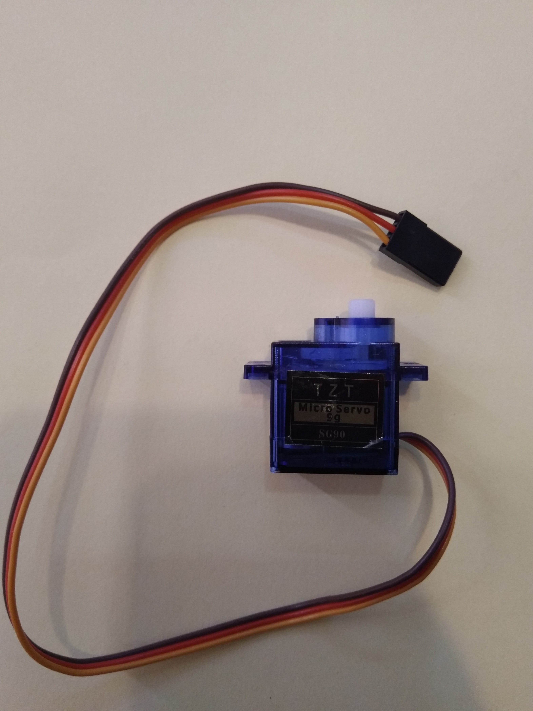

# Session 9: servo motor, PWM, and ADC

## Goal

TODO: fill

### Bonus

TODO: fill

## Servo Motor

Servo motor is a type of electeric motor that is designed for precise control.
It is widely used in robotics.
We can control the position of the servo motor by sending a PWM signal to it.
In this session, we will be using a simple DC servo motor wich only take
angles in range of [-90, 90].
This servo motor has three pins: VCC, GND, and signal.
We are connecting those pins like this:

* VCC -> 5V (Fixed voltage)
* GND -> GND
* Signal -> `PD5` of ATmega32

## Timer1

## PWM
