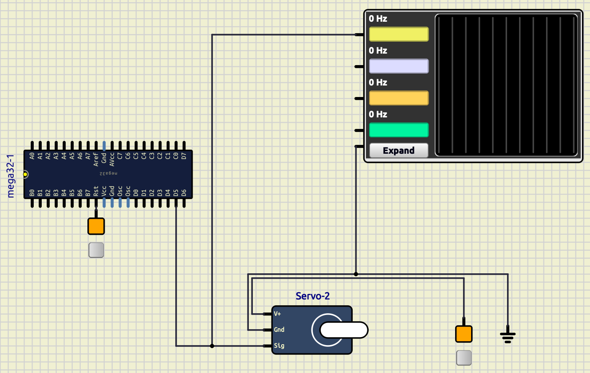

# Session 9: servo motor, PWM, and ADC

## Goal

TODO: fill

### Bonus

TODO: fill

## Servo Motor


Servo motor is a type of electeric motor that is designed for precise control.
It is widely used in robotics.
We can control the position of the servo motor by sending a PWM signal to it.
In this session, we will be using a simple DC servo motor wich only take
angles in range of [-90, 90].
-90 when we send `1000us` pulse, and 90 when we send `2000us` pulse.
The desired `PWM` frequency for this servo motor is `50Hz`.
This servo motor has three pins: VCC, GND, and signal.
We are connecting those pins like this:

* VCC -> 5V (Fixed voltage)
* GND -> GND
* Signal -> `PD5` of ATmega32

## PWM

`PWM` (Pulse Width Modulation), is a technique for controlling the power delivered to a component.  
In this technique we use different width of pulses in a signal.
These signals swith between `0` and `1`.
The percentage of the time that a pulse is `1` is called **duty cycle**.
The pictures below show two examples of 100Hz `PWM`, one with the 30% duty cycle and the other 60%.


## Create `PWM` on ATmega32

We can create `PWM` using Timers on ATmega32.
We have three timers on Atmega32:

* Timer0: 8bit
* Timer1: 16bit
* Timer2: 8bit

We can create `PWM` with all three timers.
As you can see on the picture below, each corresponding pin for each timer is shown.


* `Timer0`:
  * `OC0` -> `PB3`
* `Timer1`:
  * `OC1A` -> `PD4`
  * `OC1B` -> `PD5`
* `Timer2`:
  * `OC2` -> `PD7`

In `Timer0` and `Timer2` for generating the desired frequency we only can use a `prescaler` which
could only take values of: [1, 8, 64, 256, 1024].
As you can see this numbers are limiting.
But for `Timer1` in addition to a `prescaler`, we have another variable called `ICR1` that can
be used to control the desired freqeuency which we are going to explain more about it later.
So to generate the desired frequency for our servo motor we will be using `Timer1`.

## `Timer1`

As we discussed in the previous session, we have three timers in Atmega32.
The only timer that is `16bit` is Timer1.
We have some essential registers that we should use them to control the timer.
Also to put `Timer1` in `PWM` mode, we need these registers that we are going to talk about them.

### `TCNT1A`, `TCNT1B`

These registers are used to store the current value of the timer.

### `OCR1A`, `OCR1B`

These registers are used to compare the value of the timer with them.
We can use these registers in different modes, specially in `PWM` mode to control the `duty cycle`.

### `ICR1`

This register is used to control the frequency of the timer.
In `Fast PWM` mode, we have this formula:

$$
f_{PWM} = \frac{f_{clk}}{N \times (1 + ICR1)}
$$

* \(f_{PWM}\): desired frequency
* \(f_{clk}\): clock frequency
* \(N\): prescaler
* \(ICR1\): value of `ICR1` register

### `TCCR1A` and `TCCR1B`

Timer/Counter Register Description (TCCR) is a way that we control our timer setup.
For `Timer1` we have two registers `TCCR1A` and `TCCR1B`.

| TCCR1A        | 7      | 6      | 5      | 4      | 3     | 2     | 1     | 0     |
| ------------- | ------ | ------ | ------ | ------ | ----- | ----- | ----- | ----- |
| name          | COM1A1 | COM1A0 | COM1B1 | COM1B0 | FOC1A | FOC1B | WGM11 | WGM10 |
| Read/Write    | R/W    | R/W    | R/W    | R/W    | R/W   | R/W   | R/W   | R/W   |
| initial value | 0      | 0      | 0      | 0      | 0     | 0     | 0     | 0     |

| TCCR1B        | 7     | 6     | 5   | 4     | 3     | 2    | 1    | 0    |
| ------------- | ----- | ----- | --- | ----- | ----- | ---- | ---- | ---- |
| name          | ICNC1 | ICEC1 | -   | WGM13 | WGM12 | CS12 | CS11 | CS10 |
| Read/Write    | R/W   | R/W   | R/W | R/W   | R/W   | R/W  | R/W  | R/W  |
| initial value | 0     | 0     | 0   | 0     | 0     | 0    | 0    | 0    |

| COM1A1/COM1B1 | COM1A0/COM1B0 | Description (in fast PWM mode)                                                                                                                                        |
| ------------- | ------------- | --------------------------------------------------------------------------------------------------------------------------------------------------------------------- |
| 0             | 0             | Normal port operation, OC1A/OC1B disconnected.                                                                                                                        |
| 0             | 1             | WGM13:0 = 15: Toggle OC1A on Compare Match, OC1B disconnected (normal port operation). For all other WGM13:0 settings, normal port operation, OC1A/OC1B disconnected. |
| 1             | 0             | Clear OC1A/OC1B on compare match, set OC1A/OC1B at BOTTOM, (non-inverting mode)                                                                                       |
| 1             | 1             | Set OC1A/OC1B on compare match, clear OC1A/OC1B at BOTTOM, (inverting mode)                                                                                           |

Because we need to clear `OC1A` which is connected to `PD6` get cleared every time
it reaches the value of `OCR1A`, we put it in the `non-inverting mode`.

```cpp
TCCR1A |= (1 << COM1A1)
```

| Mode | WGM13 | WGM12 (CTC1) | WGM11 (PWM11) | WGM10 (PWM10) | Timer/Counter Mode of Operation  | TOP    | Update of OCR1x | TOV1 Flag Set on |
| ---- | ----- | ------------ | ------------- | ------------- | -------------------------------- | ------ | --------------- | ---------------- |
| 0    | 0     | 0            | 0             | 0             | Normal                           | 0xFFFF | Immediate       | MAX              |
| 1    | 0     | 0            | 0             | 1             | PWM, Phase Correct, 8-bit        | 0x00FF | TOP             | BOTTOM           |
| 2    | 0     | 0            | 1             | 0             | PWM, Phase Correct, 9-bit        | 0x01FF | TOP             | BOTTOM           |
| 3    | 0     | 0            | 1             | 1             | PWM, Phase Correct, 10-bit       | 0x03FF | TOP             | BOTTOM           |
| 4    | 0     | 1            | 0             | 0             | CTC                              | OCR1A  | Immediate       | MAX              |
| 5    | 0     | 1            | 0             | 1             | Fast PWM, 8-bit                  | 0x00FF | BOTTOM          | TOP              |
| 6    | 0     | 1            | 1             | 0             | Fast PWM, 9-bit                  | 0x01FF | BOTTOM          | TOP              |
| 7    | 0     | 1            | 1             | 1             | Fast PWM, 10-bit                 | 0x03FF | BOTTOM          | TOP              |
| 8    | 1     | 0            | 0             | 0             | PWM, Phase and Frequency Correct | ICR1   | BOTTOM          | BOTTOM           |
| 9    | 1     | 0            | 0             | 1             | PWM, Phase and Frequency Correct | OCR1A  | BOTTOM          | BOTTOM           |
| 10   | 1     | 0            | 1             | 0             | PWM, Phase Correct               | ICR1   | TOP             | BOTTOM           |
| 11   | 1     | 0            | 1             | 1             | PWM, Phase Correct               | OCR1A  | TOP             | BOTTOM           |
| 12   | 1     | 1            | 0             | 0             | CTC                              | ICR1   | Immediate       | MAX              |
| 13   | 1     | 1            | 0             | 1             | Reserved                         | –      | –               | –                |
| 14   | 1     | 1            | 1             | 0             | Fast PWM                         | ICR1   | BOTTOM          | TOP              |
| 15   | 1     | 1            | 1             | 1             | Fast PWM                         | OCR1A  | BOTTOM          | TOP              |

We need to put it on `Fast PWM` mode when we can control the frequency using `ICR1`.
So we have:

```cpp
TCCR1A |= (1 << WGM11);
TCCR1B |= (1 << WGM12) | (1 << WGM13);
```

| CS12 | CS11 | CS10 | Description                                             |
| ---- | ---- | ---- | ------------------------------------------------------- |
| 0    | 0    | 0    | No clock source (Timer/Counter stopped).                |
| 0    | 0    | 1    | clkI/1 (No prescaling)                                  |
| 0    | 1    | 0    | clkI/8 (From pre-scaler)                                |
| 0    | 1    | 1    | clkI/64 (From pre-scaler)                               |
| 1    | 0    | 0    | clkI/256 (From pre-scaler)                              |
| 1    | 0    | 1    | clkI/1024 (From pre-scaler)                             |
| 1    | 1    | 0    | External clock source on T1 pin. Clock on falling edge. |
| 1    | 1    | 1    | External clock source on T1 pin. Clock on rising edge.  |

To make our calculation easier, we put our prescaler to 8 using the code below:

```cpp
TCCR1B |= (1 << CS11);
```

## Setup our simulation

We do the following steps to setup our simulation for `pwm`.

* Put an ATmega32 on the board.(make sure to connect its reset to a fixed volatage.)
* set the clock frequency to 8MHz (in properties).
* Then put a servo motor from **Outputs/Motors/Servo Motor** on the board.
* Connect the `V+` pin of the servo motor a 5V (fixed voltage).
* Connect the `GND` pin of the servo motor to the ground.
* Connect the `Signal` pin of the servo motor to the `PD5` of the ATmega32.

Now our setup ready to write our code.
But to make sure that we are making the right frequency and to see the pulses we also add an oscilloscope to our setup.

* Put an oscope from **Meters/Oscope** on the board.
* Connect the `CH1` of the oscope to the `PD5` of the ATmega32.
* Connect the `GND` of the oscope to the ground.

So you are going to have something like this:



## Write our code

So at first let's calculate the value of `ICR1` to get the desired frequency.
We know our clock frequency is `8MHz` and the desired frequency is `50Hz`.
(Make sure to put `board_build.f_cpu = 8'000'000L` in the `platformio.ini` file.)
Also we put the prescaler to `8`.
So we have:

$$
f_{PWM} = \frac{f_{clk}}{N \times (1 + ICR1)}
\\
\Rightarrow 50 = \frac{8 \times 10^6}{8 \times (1 + ICR1)}
\\
\Rightarrow 50 = \frac{10^6}{1 + ICR1}
\\
\Rightarrow 1 + ICR1 = 20,000
\\
\Rightarrow ICR1 = 19,999
$$

Now we can write a function to intitiate our pwm.

```cpp
void pwm_init()
{
  // Set PD5 as output
  DDRD |= (1 << PD5);

  // Make sure that there is no setup other than the one we are going to put
  TCCR1A = 0;
  TCCR1B = 0;

  // non-inverting mode
  TCCR1A |= (1 << COM1A1);

  // Fast PWM mode
  TCCR1A |= (1 << WGM11);
  TCCR1B |= (1 << WGM12) | (1 << WGM13);

  // Set prescaler to 8
  TCCR1B |= (1 << CS11);

  // Set the frequency to 50Hz
  ICR1 = 19'999;
}
```

Then we can control our servo motor using `OCR1A`.
So `OCR1A=1000` would be -90 and `OCR1A=2000` would be 90.

## ADC

`ADC` (Analog to Digital Converter) converts an analog signal to a digital signal.
We used to have only `1` or `0` in the digital world.
For example if our highest voltage was `5V`, we could only have `5V` or `0V`.
But with `ADC` we can have a range of values between `5V` and `0V`.
In ATmega32 the resolution of the `ADC` is `10bit`.
So we can have `1024` different values between `5V` and `0V`.
The formula to calculate the value of the analog signal is:

$$
V_{digital} = \frac{V_{analog} \times 1023}{V_{ref}}
$$

If our reference voltage would be `5V` and we want to calculate
digital voltage when our analog voltage is `5V`, we have:

$$
V_{digital} = \frac{5 \times 1023}{5} = 1023
$$

And for `0V` we have:

$$
V_{digital} = \frac{0 \times 1023}{5} = 0
$$

We have some registers that we should set in order to get the desired value from the `ADC`.

### `ADMUX`

ADC Multiplexer Selection Register (`ADMUX`) is used to select the channel of the ADC.

| ADMUX         | 7     | 6     | 5     | 4    | 3    | 2    | 1    | 0    |
| ------------- | ----- | ----- | ----- | ---- | ---- | ---- | ---- | ---- |
| name          | REFS1 | REFS0 | ADLAR | MUX4 | MUX3 | MUX2 | MUX1 | MUX0 |
| Read/Write    | R/W   | R/W   | R/W   | R/W  | R/W  | R/W  | R/W  | R/W  |
| initial value | 0     | 0     | 0     | 0    | 0    | 0    | 0    | 0    |

| REFS1 | REFS0 | Description                                                          |
| ----- | ----- | -------------------------------------------------------------------- |
| 0     | 0     | AREF, Internal Vref turned off                                       |
| 0     | 1     | AVCC with external capacitor at AREF pin                             |
| 1     | 0     | Reserved                                                             |
| 1     | 1     | Internal 2.56V Voltage Reference with external capacitor at AREF pin |

We should set the reference voltage to `AVCC` using the code below:

```cpp
ADMUX |= (1 << REFS0);
```

* ADLAR: ADC Left Adjust Result

| MUX4 | MUX3 | MUX2 | MUX1 | MUX0 | Single Ended Input |
| ---- | ---- | ---- | ---- | ---- | ------------------ |
| 0    | 0    | 0    | 0    | 0    | ADC0               |
| 0    | 0    | 0    | 0    | 1    | ADC1               |
| 0    | 0    | 0    | 1    | 0    | ADC2               |
| 0    | 0    | 0    | 1    | 1    | ADC3               |
| 0    | 0    | 1    | 0    | 0    | ADC4               |
| 0    | 0    | 1    | 0    | 1    | ADC5               |
| 0    | 0    | 1    | 1    | 0    | ADC6               |
| 0    | 0    | 1    | 1    | 1    | ADC7               |

By setting the `MUX` bits we can select the channel of the ADC.
For example if we want to select `ADC1` we should set the `MUX` bits to `00000` using the code below:

```cpp
ADMUX &= 0xF0;
ADMUX |= 1;
```

### `ADCSRA`

ADC Control and Status Register A (`ADCSRA`) is used to control the ADC.

| ADCSRA        | 7    | 6    | 5     | 4    | 3    | 2     | 1     | 0     |
| ------------- | ---- | ---- | ----- | ---- | ---- | ----- | ----- | ----- |
| name          | ADEN | ADSC | ADATE | ADIF | ADIE | ADPS2 | ADPS1 | ADPS0 |
| Read/Write    | R/W  | R/W  | R/W   | R/W  | R/W  | R/W   | R/W   | R/W   |
| initial value | 0    | 0    | 0     | 0    | 0    | 0     | 0     | 0     |

* `ADEN`: ADC Enable
* `ADSC`: ADC Start Conversion
* `ADATE`: ADC Auto Trigger Enable
* `ADIF`: ADC Interrupt Flag
* `ADIE`: ADC Interrupt Enable

| ADPS2 | ADPS1 | ADPS0 | Division Factor |
| ----- | ----- | ----- | --------------- |
| 0     | 0     | 0     | 2               |
| 0     | 0     | 1     | 2               |
| 0     | 1     | 0     | 4               |
| 0     | 1     | 1     | 8               |
| 1     | 0     | 0     | 16              |
| 1     | 0     | 1     | 32              |
| 1     | 1     | 0     | 64              |
| 1     | 1     | 1     | 128             |

To enable the ADC we should set the `ADEN` bit to `1` using the code below:

```cpp
ADCSRA |= (1 << ADEN);
```

Then we set the prescaler to `128` using the code below:

```cpp
ADCSRA |= (1 << ADPS0) | (1 << ADPS1) | (1 << ADPS2);
```

### `ADC`

This variable is `10bit` and is used to store the value of the ADC.
It contains of two registers `ADCL` and `ADCH`.
