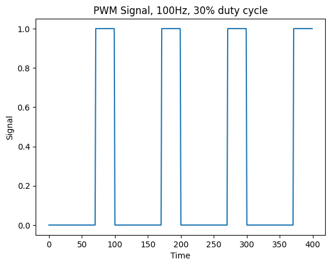
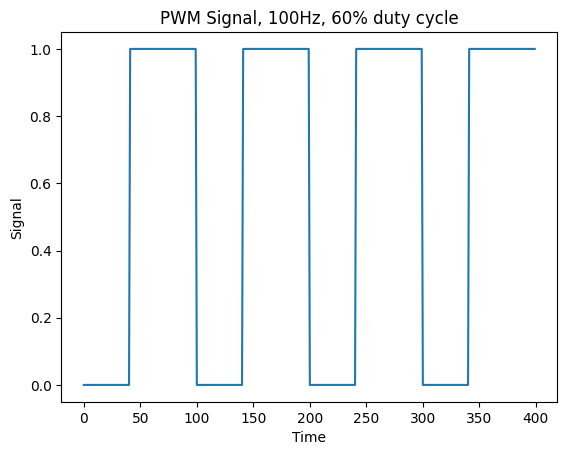

# Session 9: servo motor, PWM, and ADC

## Goal

TODO: fill

### Bonus

TODO: fill

## Servo Motor


Servo motor is a type of electeric motor that is designed for precise control.
It is widely used in robotics.
We can control the position of the servo motor by sending a PWM signal to it.
In this session, we will be using a simple DC servo motor wich only take
angles in range of [-90, 90].
The desired `PWM` frequency for this servo motor is `50Hz`.
This servo motor has three pins: VCC, GND, and signal.
We are connecting those pins like this:

* VCC -> 5V (Fixed voltage)
* GND -> GND
* Signal -> `PD5` of ATmega32

## PWM

`PWM` (Pulse Width Modulation), is a technique for controlling the power delivered to a component.  
In this technique we use different width of pulses in a signal.
These signals swith between `0` and `1`.
The percentage of the time that a pulse is `1` is called **duty cycle**.
The pictures below show two examples of 100Hz `PWM`, one with the 30% duty cycle and the other 60%.




## Create `PWM` on ATmega32

We can create `PWM` using Timers on ATmega32.
We have three timers on Atmega32:

* Timer0: 8bit
* Timer1: 16bit
* Timer2: 8bit

We can create `PWM` with all three timers.
As you can see on the picture below, each corresponding pin for each timer is shown.


* `Timer0`:
  * `OC0` -> `PB3`
* `Timer1`:
  * `OC1A` -> `PD4`
  * `OC1B` -> `PD5`
* `Timer2`:
  * `OC2` -> `PD7`

In `Timer0` and `Timer2` for generating the desired frequency we only can use a `prescaler` which
could only take values of: [1, 8, 64, 256, 1024].
As you can see this numbers are limiting.
But for `Timer1` in addition to a `prescaler`, we have another variable called `ICR1` that can
be used to control the desired freqeuency which we are going to explain more about it later.
So to generate the desired frequency for our servo motor we will be using `Timer1`.

## `Timer1`

As we discussed in the previous session, we have three timers in Atmega32.
The only timer that is `16bit` is Timer1.
To put `Timer1` in `PWM` mode, we have some registers that we are going to talk about them.

### `TCCR1A` and `TCCR1B`

Timer/Counter Register Description (TCCR) is a way that we control our timer setup.
For `Timer1` we have two registers `TCCR1A` and `TCCR1B`.

| TCCR1A        | 7      | 6      | 5      | 4      | 3     | 2     | 1     | 0     |
| ------------- | ------ | ------ | ------ | ------ | ----- | ----- | ----- | ----- |
| name          | COM1A1 | COM1A0 | COM1B1 | COM1B0 | FOC1A | FOC1B | WGM11 | WGM10 |
| Read/Write    | R/W    | R/W    | R/W    | R/W    | R/W   | R/W   | R/W   | R/W   |
| initial value | 0      | 0      | 0      | 0      | 0     | 0     | 0     | 0     |

| TCCR1B        | 7     | 6     | 5   | 4     | 3     | 2    | 1    | 0    |
| ------------- | ----- | ----- | --- | ----- | ----- | ---- | ---- | ---- |
| name          | ICNC1 | ICEC1 | -   | WGM13 | WGM12 | CS12 | CS11 | CS10 |
| Read/Write    | R/W   | R/W   | R/W | R/W   | R/W   | R/W  | R/W  | R/W  |
| initial value | 0     | 0     | 0   | 0     | 0     | 0    | 0    | 0    |

| COM1A1/COM1B1 | COM1A0/COM1B0 | Description (in fast PWM mode)                                                                                                                                        |
| ------------- | ------------- | --------------------------------------------------------------------------------------------------------------------------------------------------------------------- |
| 0             | 0             | Normal port operation, OC1A/OC1B disconnected.                                                                                                                        |
| 0             | 1             | WGM13:0 = 15: Toggle OC1A on Compare Match, OC1B disconnected (normal port operation). For all other WGM13:0 settings, normal port operation, OC1A/OC1B disconnected. |
| 1             | 0             | Clear OC1A/OC1B on compare match, set OC1A/OC1B at BOTTOM, (non-inverting mode)                                                                                       |
| 1             | 1             | Set OC1A/OC1B on compare match, clear OC1A/OC1B at BOTTOM, (inverting mode)                                                                                           |

Because we need to clear `OC1A` which is connected to `PD6` get cleared every time
it reaches the value of `OCR1A`, we put it in the `non-inverting mode`.

```cpp
TCCR1A |= (1 << COM1A1)
```

| Mode | WGM13 | WGM12 (CTC1) | WGM11 (PWM11) | WGM10 (PWM10) | Timer/Counter Mode of Operation  | TOP    | Update of OCR1x | TOV1 Flag Set on |
| ---- | ----- | ------------ | ------------- | ------------- | -------------------------------- | ------ | --------------- | ---------------- |
| 0    | 0     | 0            | 0             | 0             | Normal                           | 0xFFFF | Immediate       | MAX              |
| 1    | 0     | 0            | 0             | 1             | PWM, Phase Correct, 8-bit        | 0x00FF | TOP             | BOTTOM           |
| 2    | 0     | 0            | 1             | 0             | PWM, Phase Correct, 9-bit        | 0x01FF | TOP             | BOTTOM           |
| 3    | 0     | 0            | 1             | 1             | PWM, Phase Correct, 10-bit       | 0x03FF | TOP             | BOTTOM           |
| 4    | 0     | 1            | 0             | 0             | CTC                              | OCR1A  | Immediate       | MAX              |
| 5    | 0     | 1            | 0             | 1             | Fast PWM, 8-bit                  | 0x00FF | BOTTOM          | TOP              |
| 6    | 0     | 1            | 1             | 0             | Fast PWM, 9-bit                  | 0x01FF | BOTTOM          | TOP              |
| 7    | 0     | 1            | 1             | 1             | Fast PWM, 10-bit                 | 0x03FF | BOTTOM          | TOP              |
| 8    | 1     | 0            | 0             | 0             | PWM, Phase and Frequency Correct | ICR1   | BOTTOM          | BOTTOM           |
| 9    | 1     | 0            | 0             | 1             | PWM, Phase and Frequency Correct | OCR1A  | BOTTOM          | BOTTOM           |
| 10   | 1     | 0            | 1             | 0             | PWM, Phase Correct               | ICR1   | TOP             | BOTTOM           |
| 11   | 1     | 0            | 1             | 1             | PWM, Phase Correct               | OCR1A  | TOP             | BOTTOM           |
| 12   | 1     | 1            | 0             | 0             | CTC                              | ICR1   | Immediate       | MAX              |
| 13   | 1     | 1            | 0             | 1             | Reserved                         | –      | –               | –                |
| 14   | 1     | 1            | 1             | 0             | Fast PWM                         | ICR1   | BOTTOM          | TOP              |
| 15   | 1     | 1            | 1             | 1             | Fast PWM                         | OCR1A  | BOTTOM          | TOP              |

We need to put it on `Fast PWM` mode when we can control the frequency using `ICR1`.
So we have:

```cpp
TCCR1A |= (1 << WGM11);
TCCR1B |= (1 << WGM12) | (1 << WGM13);
```

## Connect servo motor to ATmega32 in SimulIDE

To add a servo motor in SimulIDE, we should go to
`Outputs/Motors/Servo Motor`.
Then we
